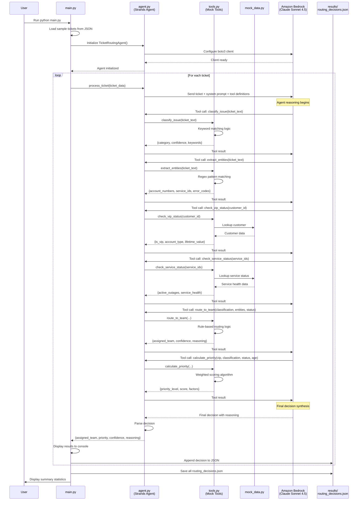

# Design Document: AI-Powered Customer Support System - MVP

## Overview

This document specifies the MVP design for an AI-powered ticket routing system. The MVP is a local Python application that validates the agentic approach using Amazon Bedrock for AI reasoning and mock interfaces for external systems.

**MVP Goal**: Demonstrate intelligent ticket routing with minimal infrastructure in 2-4 hours.

**Key Characteristics**:
- Local Python application (no AWS infrastructure except Bedrock)
- Mock data for all external systems
- Real AI reasoning via Amazon Bedrock
- CLI or optional Streamlit GUI
- JSON file storage for results

## Design Principles

1. **Simplicity First**: Minimal code, maximum validation
2. **Real AI**: Use actual Bedrock API for authentic agent behavior
3. **Mock Everything Else**: Simulate external systems with in-memory data
4. **Rapid Iteration**: Fast setup and testing cycles
5. **Production Preview**: Architecture mirrors production design

## MVP Architecture

```
┌─────────────────────────────────────────────────────────────┐
│                    LOCAL PYTHON APPLICATION                  │
├─────────────────────────────────────────────────────────────┤
│                                                              │
│  ┌────────────────────────────────────────────────────┐    │
│  │  main.py (CLI Interface)                           │    │
│  │  - Load sample tickets from JSON                   │    │
│  │  - Display routing results                         │    │
│  │  - Show agent reasoning                            │    │
│  └────────────┬───────────────────────────────────────┘    │
│               │                                              │
│               ▼                                              │
│  ┌────────────────────────────────────────────────────┐    │
│  │  agent.py (Ticket Routing Agent)                   │    │
│  │  - Initialize Strands agent                        │    │
│  │  - Configure Bedrock client                        │    │
│  │  - Execute agent with tools                        │    │
│  │  - Parse and return decisions                      │    │
│  └────────────┬───────────────────────────────────────┘    │
│               │                                              │
│               ▼                                              │
│  ┌────────────────────────────────────────────────────┐    │
│  │  tools.py (Mock Tool Implementations)              │    │
│  │  ┌──────────────────────────────────────────────┐ │    │
│  │  │ classify_issue() - Keyword-based classifier  │ │    │
│  │  │ extract_entities() - Regex extraction        │ │    │
│  │  │ check_vip_status() - Mock customer DB        │ │    │
│  │  │ check_service_status() - Mock service API    │ │    │
│  │  │ calculate_priority() - Scoring algorithm     │ │    │
│  │  │ route_to_team() - Rule-based routing         │ │    │
│  │  │ get_historical_context() - Mock history      │ │    │
│  │  └──────────────────────────────────────────────┘ │    │
│  └────────────┬───────────────────────────────────────┘    │
│               │                                              │
│               ▼                                              │
│  ┌────────────────────────────────────────────────────┐    │
│  │  mock_data.py (Sample Data)                        │    │
│  │  - Sample tickets (10-20 examples)                 │    │
│  │  - Mock customer database                          │    │
│  │  - Mock service status                             │    │
│  │  - Mock historical tickets                         │    │
│  └────────────────────────────────────────────────────┘    │
│                                                              │
└──────────────────────────┬───────────────────────────────────┘
                           │
                           │ AWS SDK (boto3)
                           ▼
                ┌──────────────────────────┐
                │  Amazon Bedrock          │
                │  (Claude Sonnet 4.5)     │
                │  - Real AI reasoning     │
                │  - Tool calling          │
                │  - Decision making       │
                └──────────────────────────┘
```

## MVP Sequence Diagram



## Project Structure

```
ticket-routing-mvp/
├── README.md                    # Setup and usage instructions
├── requirements.txt             # Python dependencies (includes pydantic)
├── .env.example                 # Environment variables template
├── .gitignore                   # Git ignore file
├── config.py                    # Configuration settings
├── models.py                    # Pydantic data models (NEW)
├── main.py                      # CLI entry point
├── agent.py                     # Strands agent implementation
├── tools.py                     # Tool implementations (mock)
├── agent_tools.py               # Multi-agent tools (optional)
├── streamlit_app.py             # GUI (optional)
├── mock_data.py                 # Sample data and mock databases
├── sample_tickets.json          # Test ticket data
└── results/                     # Output directory for results
    └── routing_decisions.json   # Saved routing decisions
```

## Data Models

**All data models MUST be implemented as Pydantic BaseModel classes** to ensure type safety, validation, and serialization consistency.

### Core Data Models (models.py)

```python
from pydantic import BaseModel, Field, validator
from typing import List, Dict, Any, Optional
from datetime import datetime
from enum import Enum

class PriorityLevel(str, Enum):
    """Priority level enumeration"""
    P0 = "P0"
    P1 = "P1"
    P2 = "P2"
    P3 = "P3"

class Team(str, Enum):
    """Team enumeration"""
    NETWORK_OPS = "Network Operations"
    BILLING = "Billing Support"
    TECHNICAL = "Technical Support"
    ACCOUNT_MGMT = "Account Management"

class AccountType(str, Enum):
    """Account type enumeration"""
    ENTERPRISE = "Enterprise"
    CONSUMER = "Consumer"
    BUSINESS = "Business"

class ServiceHealth(str, Enum):
    """Service health status"""
    HEALTHY = "Healthy"
    DEGRADED = "Degraded"
    OUTAGE = "Outage"

class Ticket(BaseModel):
    """Incoming support ticket"""
    ticket_id: str = Field(..., description="Unique ticket identifier")
    customer_id: str = Field(..., description="Customer identifier")
    subject: str = Field(..., min_length=1, description="Ticket subject")
    description: str = Field(..., min_length=1, description="Ticket description")
    timestamp: datetime = Field(default_factory=datetime.utcnow, description="Ticket creation time")
    
    @validator('ticket_id', 'customer_id')
    def validate_ids(cls, v):
        if not v or not v.strip():
            raise ValueError("ID cannot be empty")
        return v.strip()

class Customer(BaseModel):
    """Customer information"""
    customer_id: str = Field(..., description="Customer identifier")
    is_vip: bool = Field(default=False, description="VIP status")
    account_type: AccountType = Field(default=AccountType.CONSUMER, description="Account type")
    lifetime_value: float = Field(ge=0, description="Customer lifetime value")
    account_standing: str = Field(default="Good", description="Account standing")
    service_plan: str = Field(..., description="Service plan name")

class Outage(BaseModel):
    """Service outage information"""
    service_id: str = Field(..., description="Service identifier")
    severity: str = Field(..., description="Outage severity")
    started_at: datetime = Field(..., description="Outage start time")
    description: Optional[str] = Field(None, description="Outage description")

class ServiceStatus(BaseModel):
    """Service status information"""
    service_id: str = Field(..., description="Service identifier")
    service_health: ServiceHealth = Field(..., description="Current health status")
    active_outages: List[Outage] = Field(default_factory=list, description="Active outages")

class IssueClassification(BaseModel):
    """Issue classification result"""
    primary_category: str = Field(..., description="Primary issue category")
    confidence: float = Field(ge=0.0, le=1.0, description="Classification confidence")
    keywords: List[str] = Field(default_factory=list, description="Matched keywords")
    secondary_categories: List[str] = Field(default_factory=list, description="Alternative categories")

class ExtractedEntities(BaseModel):
    """Extracted entities from ticket"""
    account_numbers: List[str] = Field(default_factory=list, description="Account numbers")
    service_ids: List[str] = Field(default_factory=list, description="Service IDs")
    error_codes: List[str] = Field(default_factory=list, description="Error codes")
    phone_numbers: List[str] = Field(default_factory=list, description="Phone numbers")
    monetary_amounts: List[float] = Field(default_factory=list, description="Monetary amounts")

class PriorityCalculation(BaseModel):
    """Priority calculation result"""
    priority_level: PriorityLevel = Field(..., description="Calculated priority")
    priority_score: float = Field(ge=0, le=100, description="Numeric priority score")
    factors: Dict[str, Any] = Field(default_factory=dict, description="Contributing factors")
    reasoning: str = Field(..., description="Priority reasoning")

class RoutingDecision(BaseModel):
    """Team routing decision"""
    assigned_team: Team = Field(..., description="Assigned team")
    confidence: float = Field(ge=0.0, le=1.0, description="Routing confidence")
    alternative_teams: List[Team] = Field(default_factory=list, description="Alternative teams")
    reasoning: str = Field(..., description="Routing reasoning")
    requires_manual_review: bool = Field(default=False, description="Manual review flag")

class HistoricalTicket(BaseModel):
    """Historical ticket information"""
    ticket_id: str = Field(..., description="Ticket identifier")
    issue_type: str = Field(..., description="Issue type")
    resolution_time_hours: float = Field(ge=0, description="Resolution time")
    escalated: bool = Field(default=False, description="Escalation flag")
    resolved_at: datetime = Field(..., description="Resolution timestamp")

class HistoricalContext(BaseModel):
    """Customer historical context"""
    recent_tickets: List[HistoricalTicket] = Field(default_factory=list, description="Recent tickets")
    common_issues: List[str] = Field(default_factory=list, description="Common issue types")
    escalation_history: bool = Field(default=False, description="Has escalation history")

class FinalDecision(BaseModel):
    """Final routing decision with all context"""
    ticket_id: str = Field(..., description="Ticket identifier")
    customer_id: str = Field(..., description="Customer identifier")
    assigned_team: Team = Field(..., description="Assigned team")
    priority_level: PriorityLevel = Field(..., description="Priority level")
    confidence_score: float = Field(ge=0, le=100, description="Overall confidence")
    reasoning: str = Field(..., description="Decision reasoning")
    processing_time_ms: float = Field(ge=0, description="Processing time in milliseconds")
    requires_manual_review: bool = Field(default=False, description="Manual review flag")
    timestamp: datetime = Field(default_factory=datetime.utcnow, description="Decision timestamp")
```

## Component Design

### 1. Configuration (config.py)

**Purpose**: Centralize all configuration settings

**Key Settings**:
```python
# Bedrock Configuration
BEDROCK_REGION = 'us-east-1'
BEDROCK_MODEL_ID = 'anthropic.claude-sonnet-4-5-v2'

# Agent Configuration
AGENT_CONFIG = {
    'temperature': 0.1,
    'max_tokens': 4096,
    'max_iterations': 10,
    'timeout_seconds': 30
}

# Confidence Threshold
CONFIDENCE_THRESHOLD = 0.7

# Teams and Priority Levels (use enums from models.py)
TEAMS = [team.value for team in Team]
PRIORITY_LEVELS = [level.value for level in PriorityLevel]
```

### 2. Mock Data (mock_data.py)

**Purpose**: Provide sample data for testing without external dependencies

**All mock data MUST use Pydantic models for type safety and validation.**

**Mock Customer Database**:
```python
from models import Customer, AccountType

MOCK_CUSTOMERS: Dict[str, Customer] = {
    'CUST001': Customer(
        customer_id='CUST001',
        is_vip=True,
        account_type=AccountType.ENTERPRISE,
        lifetime_value=50000,
        account_standing='Good',
        service_plan='Premium'
    ),
    'CUST002': Customer(
        customer_id='CUST002',
        is_vip=False,
        account_type=AccountType.CONSUMER,
        lifetime_value=500,
        account_standing='Good',
        service_plan='Basic'
    )
}
```

**Mock Service Status**:
```python
from models import ServiceStatus, ServiceHealth, Outage
from datetime import datetime

MOCK_SERVICE_STATUS: Dict[str, ServiceStatus] = {
    'SVC001': ServiceStatus(
        service_id='SVC001',
        service_health=ServiceHealth.OUTAGE,
        active_outages=[
            Outage(
                service_id='SVC001',
                severity='Critical',
                started_at=datetime.fromisoformat('2024-02-14T10:00:00'),
                description='Network connectivity issues'
            )
        ]
    )
}
```

**Sample Tickets**:
```python
from models import Ticket
from datetime import datetime

SAMPLE_TICKETS: List[Ticket] = [
    Ticket(
        ticket_id='TKT-001',
        customer_id='CUST001',
        subject='Internet connection down',
        description='My internet has been down for 2 hours. Error code: NET-500.',
        timestamp=datetime.fromisoformat('2024-02-14T12:00:00')
    )
]
```

### 3. Agent Tools (tools.py)

**Purpose**: Implement 7 agent tools with mock logic

**All tool functions MUST accept and return Pydantic models for type safety.**

#### Tool 1: classify_issue()

**Logic**: Keyword-based classification
```python
from models import IssueClassification

def classify_issue(ticket_text: str) -> IssueClassification:
    """Classify ticket using keyword matching"""
    patterns = {
        'Network Outage': ['outage', 'down', 'offline', 'connection'],
        'Billing Dispute': ['bill', 'charge', 'invoice', 'payment'],
        'Technical Problem': ['error', 'not working', 'broken'],
        'Account Access': ['password', 'login', 'access', 'account']
    }
    # Calculate scores and return IssueClassification model
    # ...
    return IssueClassification(
        primary_category=best_category,
        confidence=best_score,
        keywords=matched_keywords,
        secondary_categories=alternatives
    )
```

#### Tool 2: extract_entities()

**Logic**: Regex pattern matching
```python
from models import ExtractedEntities
import re

def extract_entities(ticket_text: str) -> ExtractedEntities:
    """Extract entities using regex patterns"""
    return ExtractedEntities(
        account_numbers=re.findall(r'ACC-\d+', ticket_text),
        service_ids=re.findall(r'SVC\d+', ticket_text),
        error_codes=re.findall(r'[A-Z]+-\d+', ticket_text),
        phone_numbers=re.findall(r'\d{3}-\d{3}-\d{4}', ticket_text),
        monetary_amounts=[float(m) for m in re.findall(r'\$(\d+(?:\.\d{2})?)', ticket_text)]
    )
```

#### Tool 3: check_vip_status()

**Logic**: Mock database lookup
```python
from models import Customer, AccountType

def check_vip_status(customer_id: str) -> Customer:
    """Check VIP status from mock database"""
    return MOCK_CUSTOMERS.get(customer_id, Customer(
        customer_id=customer_id,
        is_vip=False,
        account_type=AccountType.CONSUMER,
        lifetime_value=0,
        account_standing='Good',
        service_plan='Basic'
    ))
```

#### Tool 4: check_service_status()

**Logic**: Mock service API
```python
from models import ServiceStatus, ServiceHealth, Outage
from typing import List

def check_service_status(service_ids: List[str]) -> ServiceStatus:
    """Check service status from mock data"""
    all_outages: List[Outage] = []
    worst_health = ServiceHealth.HEALTHY
    
    for svc_id in service_ids:
        status = MOCK_SERVICE_STATUS.get(svc_id)
        if status:
            all_outages.extend(status.active_outages)
            if status.service_health == ServiceHealth.OUTAGE:
                worst_health = ServiceHealth.OUTAGE
    
    return ServiceStatus(
        service_id=','.join(service_ids),
        service_health=worst_health,
        active_outages=all_outages
    )
```

#### Tool 5: calculate_priority()

**Logic**: Weighted scoring algorithm
```python
from models import PriorityCalculation, PriorityLevel, Customer, IssueClassification, ServiceStatus

def calculate_priority(
    vip_status: Customer,
    issue_classification: IssueClassification,
    service_status: ServiceStatus,
    ticket_age_hours: float
) -> PriorityCalculation:
    """Calculate priority using weighted scoring"""
    score = 0
    factors = {}
    
    # VIP contribution (30%)
    if vip_status.is_vip:
        score += 30
        factors['vip_bonus'] = 30
    elif vip_status.account_type == AccountType.ENTERPRISE:
        score += 20
        factors['enterprise_bonus'] = 20
    
    # Severity contribution (40%)
    severity_map = {
        'Network Outage': 40,
        'Account Access': 30,
        'Technical Problem': 20,
        'Billing Dispute': 10
    }
    severity_score = severity_map.get(issue_classification.primary_category, 20)
    score += severity_score
    factors['severity'] = severity_score
    
    # Age contribution (20%)
    if ticket_age_hours >= 48:
        score += 20
        factors['age_penalty'] = 20
    elif ticket_age_hours >= 24:
        score += 10
        factors['age_penalty'] = 10
    
    # Outage contribution (10%)
    if service_status.service_health == ServiceHealth.OUTAGE:
        score += 10
        factors['outage_impact'] = 10
    
    # Determine priority level
    if score >= 80:
        priority_level = PriorityLevel.P0
    elif score >= 60:
        priority_level = PriorityLevel.P1
    elif score >= 40:
        priority_level = PriorityLevel.P2
    else:
        priority_level = PriorityLevel.P3
    
    return PriorityCalculation(
        priority_level=priority_level,
        priority_score=score,
        factors=factors,
        reasoning=f'Score: {score} - {", ".join(f"{k}={v}" for k, v in factors.items())}'
    )
```

#### Tool 6: route_to_team()

**Logic**: Rule-based routing
```python
from models import RoutingDecision, Team, IssueClassification, ExtractedEntities, ServiceStatus

def route_to_team(
    issue_classification: IssueClassification,
    entities: ExtractedEntities,
    service_status: ServiceStatus
) -> RoutingDecision:
    """Route to team based on issue classification"""
    routing_map = {
        'Network Outage': (Team.NETWORK_OPS, 0.9),
        'Billing Dispute': (Team.BILLING, 0.9),
        'Technical Problem': (Team.TECHNICAL, 0.8),
        'Account Access': (Team.ACCOUNT_MGMT, 0.9)
    }
    
    category = issue_classification.primary_category
    team, confidence = routing_map.get(category, (Team.TECHNICAL, 0.6))
    
    return RoutingDecision(
        assigned_team=team,
        confidence=confidence,
        alternative_teams=[],
        reasoning=f'Classified as {category}, routing to {team.value}',
        requires_manual_review=confidence < 0.7
    )
```

#### Tool 7: get_historical_context()

**Logic**: Mock history lookup
```python
from models import HistoricalContext, HistoricalTicket

def get_historical_context(customer_id: str, limit: int = 5) -> HistoricalContext:
    """Get historical tickets from mock data"""
    history = MOCK_HISTORY.get(customer_id, [])
    
    return HistoricalContext(
        recent_tickets=history[:limit],
        common_issues=list(set(t.issue_type for t in history)),
        escalation_history=any(t.escalated for t in history)
    )
```

### 4. Agent Implementation (agent.py)

**Purpose**: Wrap Strands agent with Bedrock integration

**All agent methods MUST use Pydantic models for input/output.**

**Key Components**:
```python
from models import Ticket, FinalDecision, Team, PriorityLevel
from typing import Dict, Any
import boto3
from datetime import datetime
import time

class TicketRoutingAgent:
    def __init__(self, use_agent_tools=False):
        self.bedrock = boto3.client('bedrock-runtime', region_name=BEDROCK_REGION)
        
        # System prompt for agent
        self.system_prompt = """You are an expert customer support ticket routing agent..."""
        
        # Initialize Strands agent
        self.agent = Agent(
            name="TicketRoutingAgent",
            model=f"bedrock/{BEDROCK_MODEL_ID}",
            system_prompt=self.system_prompt,
            tools=[...],  # 7 tools
            **AGENT_CONFIG
        )
    
    def process_ticket(self, ticket: Ticket) -> FinalDecision:
        """Process a ticket and return routing decision"""
        start_time = time.time()
        
        ticket_prompt = f"""Route this support ticket:
        
        Ticket ID: {ticket.ticket_id}
        Customer ID: {ticket.customer_id}
        Subject: {ticket.subject}
        Description: {ticket.description}
        
        Analyze this ticket and determine the correct team and priority."""
        
        try:
            result = self.agent.run(ticket_prompt)
            decision = self._parse_decision(result, ticket)
            
            # Add processing time
            processing_time = (time.time() - start_time) * 1000
            decision.processing_time_ms = processing_time
            
            return decision
        except Exception as e:
            return self._fallback_decision(ticket, str(e))
    
    def _parse_decision(self, result: Any, ticket: Ticket) -> FinalDecision:
        """Parse agent result into FinalDecision model"""
        # Extract decision from agent result
        # Return FinalDecision Pydantic model
        return FinalDecision(
            ticket_id=ticket.ticket_id,
            customer_id=ticket.customer_id,
            assigned_team=Team.TECHNICAL,  # Parse from result
            priority_level=PriorityLevel.P2,  # Parse from result
            confidence_score=85.0,  # Parse from result
            reasoning="...",  # Parse from result
            processing_time_ms=0,  # Set by process_ticket
            requires_manual_review=False
        )
    
    def _fallback_decision(self, ticket: Ticket, error: str) -> FinalDecision:
        """Provide fallback decision when agent fails"""
        return FinalDecision(
            ticket_id=ticket.ticket_id,
            customer_id=ticket.customer_id,
            assigned_team=Team.TECHNICAL,
            priority_level=PriorityLevel.P2,
            confidence_score=50.0,
            reasoning=f"Fallback routing due to error: {error}",
            processing_time_ms=0,
            requires_manual_review=True
        )
```

### 5. CLI Interface (main.py)

**Purpose**: Provide command-line interface for ticket processing

**All data handling MUST use Pydantic models.**

**Key Features**:
- Load sample tickets as Pydantic Ticket models
- Initialize agent
- Process tickets sequentially
- Display results with formatting
- Save to JSON using Pydantic's .model_dump_json()
- Show summary statistics

**Example Implementation**:
```python
from models import Ticket, FinalDecision
from typing import List
import json
from pathlib import Path

def load_tickets() -> List[Ticket]:
    """Load sample tickets as Pydantic models"""
    return SAMPLE_TICKETS  # Already Pydantic models from mock_data.py

def save_results(decisions: List[FinalDecision], output_path: str):
    """Save decisions to JSON using Pydantic serialization"""
    Path(output_path).parent.mkdir(parents=True, exist_ok=True)
    
    # Use Pydantic's built-in JSON serialization
    with open(output_path, 'w') as f:
        json_data = [d.model_dump() for d in decisions]
        json.dump(json_data, f, indent=2, default=str)

def main():
    tickets = load_tickets()
    agent = TicketRoutingAgent()
    decisions: List[FinalDecision] = []
    
    for ticket in tickets:
        decision = agent.process_ticket(ticket)
        decisions.append(decision)
        print(f"✓ Routed {ticket.ticket_id} to {decision.assigned_team.value}")
    
    save_results(decisions, 'results/routing_decisions.json')
```

**Example Output**:
```
============================================================
AI-Powered Ticket Routing System - MVP
============================================================

Initializing agent with Bedrock...
✓ Agent initialized

Processing Ticket 1/10: TKT-001
Subject: Internet connection down
✓ Routed to: Network Operations
  Priority: P1
  Confidence: 95%
  Time: 2,345ms
  Reasoning: VIP customer with network outage...

...

============================================================
SUMMARY
============================================================
Total tickets processed: 10
Average processing time: 2,456ms
Tickets requiring manual review: 1
Average confidence: 87.3%

Team Distribution:
  Network Operations: 3 tickets
  Billing Support: 2 tickets
  Technical Support: 4 tickets
  Account Management: 1 ticket
```

## Bedrock Integration

### Model Configuration

**Model**: Claude Sonnet 4.5 (`anthropic.claude-sonnet-4-5-v2`)

**Configuration**:
```python
{
    'temperature': 0.1,  # Low for consistent decisions
    'max_tokens': 4096,
    'top_p': 0.9,
    'stop_sequences': None
}
```

**Cost Estimate**:
- Average ticket: ~500 input tokens + ~300 output tokens
- Cost per ticket: ~$0.006
- 50 test tickets: ~$0.30

### Agent System Prompt

```
You are an expert customer support ticket routing agent for a telecom company.

Your goal is to analyze incoming support tickets and route them to the correct team with appropriate priority.

AVAILABLE TEAMS:
- Network Operations: Handles network outages, connectivity issues
- Billing Support: Handles billing disputes, payment issues
- Technical Support: Handles device issues, technical problems
- Account Management: Handles account access, password resets

PRIORITY LEVELS:
- P0 (Critical): VIP customer + service outage
- P1 (High): VIP customer issues or critical problems
- P2 (Medium): Standard customer issues
- P3 (Low): General inquiries

YOUR PROCESS:
1. Use classify_issue() and extract_entities() to understand the ticket
2. Use check_vip_status() to determine customer importance
3. Use check_service_status() to identify active outages
4. Use route_to_team() to determine the best team
5. Use calculate_priority() to set appropriate priority
6. Make your final decision with confidence score

Always explain your reasoning clearly.
```

## Development Timeline

### Hour 1: Setup and Core Structure
- Create project directory
- Set up virtual environment
- Install dependencies (strands-agents, boto3, python-dotenv, pydantic)
- Create config.py with settings
- Create models.py with all Pydantic data models
- Create mock_data.py with sample data using Pydantic models

### Hour 2: Tool Implementation
- Implement all 7 tools in tools.py using Pydantic models
- Test each tool independently
- Create diverse sample tickets as Pydantic models
- Verify tool outputs and model validation

### Hour 3: Agent Integration
- Implement agent.py with Strands wrapper using Pydantic models
- Configure Bedrock client
- Integrate tools with agent
- Test agent execution with 1-2 tickets

### Hour 4: CLI and Testing
- Build main.py CLI interface with Pydantic model handling
- Process all sample tickets
- Generate results and reports using Pydantic serialization
- Validate routing decisions
- Document findings

## Testing Strategy

### Unit Testing Tools
```python
from models import Ticket, IssueClassification, ExtractedEntities

# Test each tool independently with Pydantic models
def test_classify_issue():
    result = classify_issue("Internet is down")
    assert isinstance(result, IssueClassification)
    assert result.primary_category == 'Network Outage'
    assert result.confidence > 0.5

def test_extract_entities():
    result = extract_entities("Error NET-500 on SVC001")
    assert isinstance(result, ExtractedEntities)
    assert 'NET-500' in result.error_codes
    assert 'SVC001' in result.service_ids

def test_pydantic_validation():
    """Test that Pydantic validation catches invalid data"""
    with pytest.raises(ValidationError):
        Ticket(ticket_id="", customer_id="CUST001", subject="", description="test")
```

### Integration Testing
```python
from models import Ticket, FinalDecision, Team, PriorityLevel

# Test full agent flow with Pydantic models
def test_agent_routing():
    agent = TicketRoutingAgent()
    ticket = SAMPLE_TICKETS[0]  # Pydantic Ticket model
    decision = agent.process_ticket(ticket)
    
    assert isinstance(decision, FinalDecision)
    assert isinstance(decision.assigned_team, Team)
    assert isinstance(decision.priority_level, PriorityLevel)
    assert 0 <= decision.confidence_score <= 100
    assert len(decision.reasoning) > 0
```

### Sample Ticket Coverage
- Network outage (VIP and non-VIP)
- Billing dispute (with monetary amounts)
- Technical problem (with error codes)
- Account access (password reset)
- Ambiguous tickets (multiple issues)
- Edge cases (missing information, validation errors)

## Success Criteria

1. ✅ Complete setup in < 15 minutes
2. ✅ Process 10-20 tickets successfully
3. ✅ Average processing time < 5 seconds
4. ✅ Agent provides clear reasoning for all decisions
5. ✅ Confidence scores vary based on ticket clarity
6. ✅ Tickets distributed across all 4 teams
7. ✅ VIP customers get higher priority
8. ✅ Network outages route to Network Operations
9. ✅ Results saved to JSON correctly
10. ✅ Summary statistics are accurate

## Limitations

1. **No Persistence**: Results only in JSON files
2. **Mock Data**: Not representative of real-world complexity
3. **Sequential Processing**: One ticket at a time
4. **No Error Recovery**: Basic error handling only
5. **Limited Scalability**: Not designed for high volume
6. **No Monitoring**: Console logging only
7. **No Authentication**: No security controls
8. **No Integration**: No real external systems

## Migration to Production

The MVP provides a clear foundation for production:

1. **Tools**: Replace mock implementations with real API calls
2. **Storage**: Migrate from JSON to DynamoDB
3. **Deployment**: Package agent as Lambda function
4. **Integration**: Add EventBridge and API Gateway
5. **Monitoring**: Implement CloudWatch metrics
6. **Scaling**: Enable Lambda concurrency
7. **Security**: Add IAM roles and encryption
8. **Testing**: Add comprehensive test suite

## Related Documents

- [MVP Requirements](./requirements.md)
- [Production Design](../ai-customer-support-system/design-production.md)
- [Implementation Guide](../../steering/ai-customer-support-implementation.md)
