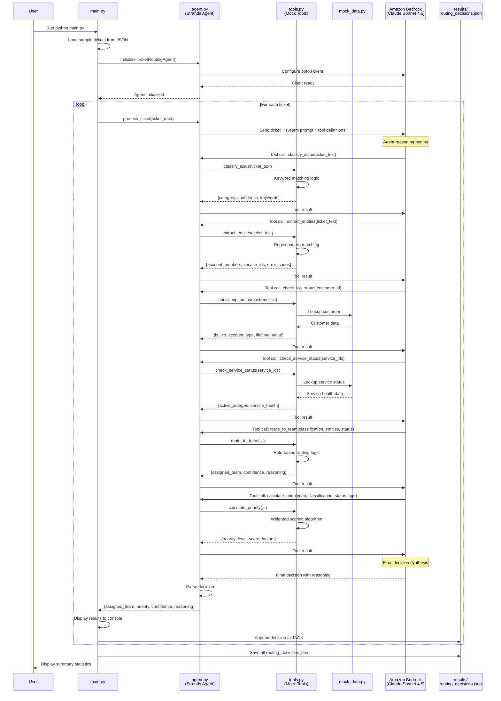

# Design Document: AI-Powered Customer Support System

## Overview

This document provides an overview of the design for an AI-powered customer support ticket routing system. The system uses Amazon Bedrock (Claude Sonnet 4.5) as the reasoning engine and the Strands Agent Framework for autonomous decision-making with tool orchestration.

**The design has been split into two focused documents:**

1. **[MVP Design](../ai-customer-support-system-mvp/design.md)** - Local Python application (2-4 hours development)
2. **[Production Design](./design-production.md)** - AWS infrastructure deployment (2-3 days)

## Quick Reference

### MVP Design
- **Goal**: Validate agentic approach with minimal infrastructure
- **Deployment**: Local Python application (CLI or Streamlit)
- **Timeline**: 2-4 hours for core, +2-4 hours for enhancements
- **Cost**: ~$0.006 per ticket (Bedrock API only)
- **Document**: [design.md](../ai-customer-support-system-mvp/design.md)

### Production Design
- **Goal**: Deploy scalable, reliable system on AWS
- **Deployment**: Lambda, DynamoDB, EventBridge, API Gateway
- **Timeline**: 2-3 days for initial deployment
- **Cost**: ~$0.09 per ticket, $280/month for 1,000 tickets/day
- **Document**: [design-production.md](./design-production.md)

## Key Design Principles

1. **Agentic Architecture**: Autonomous agent with tool-calling capabilities for flexible decision-making
2. **AWS-Native**: Leverages AWS services for scalability, reliability, and cost-effectiveness (Production)
3. **Stateless Processing**: Each ticket processed independently for horizontal scalability
4. **Fail-Safe**: Graceful degradation with manual review fallback for low-confidence decisions
5. **Observable**: Comprehensive logging and metrics for monitoring and improvement

## System Overview

### Core Components

**AI Agent**:
- Amazon Bedrock (Claude Sonnet 4.5) for reasoning
- Strands Agent Framework for orchestration
- 7 specialized tools for information gathering and decision-making

**Agent Tools**:
1. `classify_issue()` - Categorize ticket into 4 issue types
2. `extract_entities()` - Extract account numbers, error codes, service IDs
3. `check_vip_status()` - Determine customer importance
4. `check_service_status()` - Check for active outages
5. `calculate_priority()` - Weighted scoring (P0-P3)
6. `route_to_team()` - Assign to 1 of 4 support teams
7. `get_historical_context()` - Retrieve past tickets

**Support Teams**:
- Network Operations
- Billing Support
- Technical Support
- Account Management

**Issue Categories**:
- Network Outage
- Billing Dispute
- Technical Problem
- Account Access

**Priority Levels**:
- P0 (Critical): VIP + outage or widespread issues
- P1 (High): VIP issues or critical problems
- P2 (Medium): Standard issues
- P3 (Low): General inquiries

## Architecture Comparison

### MVP Architecture (Local)

```
Local Python Application
├── main.py (CLI)
├── agent.py (Strands Agent)
├── tools.py (Mock implementations)
├── mock_data.py (Sample data)
└── results/ (JSON output)
         │
         │ AWS SDK (boto3)
         ▼
    Amazon Bedrock
    (Claude Sonnet 4.5)
```

**Characteristics**:
- Single Python process
- In-memory mock data
- JSON file storage
- Console logging
- 2-4 hours development

### Production Architecture (AWS)

```
External Systems → API Gateway → Lambda (Ingestion)
                                      ↓
                                 EventBridge
                                      ↓
                            Lambda (Agent Orchestrator)
                                      ↓
                            Amazon Bedrock + Tools
                                      ↓
                                  DynamoDB
                                      ↓
                            Lambda (System Update)
                                      ↓
                              External Systems
```

**Characteristics**:
- Distributed Lambda functions
- Event-driven architecture
- DynamoDB persistence
- CloudWatch monitoring
- 2-3 days deployment

## Key Differences: MVP vs Production

| Aspect | MVP (Local) | Production (AWS) |
|--------|-------------|------------------|
| **Deployment** | Single Python process | Distributed Lambda functions |
| **Data Storage** | In-memory dictionaries | DynamoDB tables |
| **External Systems** | Mock functions | Real API integrations |
| **Scalability** | Single-threaded | Auto-scaling, parallel processing |
| **Monitoring** | Console logs | CloudWatch metrics, alarms, dashboards |
| **Error Handling** | Basic try-catch | Retry logic, DLQ, exponential backoff |
| **Integration** | CLI interface | API Gateway, EventBridge, webhooks |
| **Persistence** | JSON files | DynamoDB with TTL and backups |
| **Cost** | ~$0.006/ticket | ~$0.09/ticket |
| **Development Time** | 2-4 hours | 2-3 days |
| **Availability** | N/A | 99.9% SLA |
| **Throughput** | 10-20 tickets | 1,000+ tickets/day |

## Sequence Diagrams

### MVP Sequence

See [MVP Design Document](../ai-customer-support-system-mvp/design.md#mvp-sequence-diagram) for the complete sequence showing:
- CLI ticket loading
- Agent initialization with Bedrock
- Tool calls to mock data
- Results saved to JSON

### Production Sequence

See [Production Design Document](./design-production.md#production-sequence-diagram) for the complete sequence showing:
- API Gateway webhook
- EventBridge event flow
- Lambda agent orchestration
- DynamoDB storage
- Ticketing system updates
- CloudWatch monitoring

## Agent Design

### Agent Responsibility

The **Ticket Routing Agent** is an autonomous AI agent responsible for:

1. **Understanding** the ticket content and context
2. **Analyzing** customer status, service health, and historical patterns
3. **Deciding** the appropriate support team and priority level
4. **Executing** the routing decision with confidence scoring
5. **Handling** edge cases and ambiguous situations

### Agent System Prompt

```
You are an expert customer support ticket routing agent for a telecom company.

Your goal is to analyze incoming support tickets and route them to the correct team with appropriate priority.

AVAILABLE TEAMS:
- Network Operations: Handles network outages, connectivity issues
- Billing Support: Handles billing disputes, payment issues
- Technical Support: Handles device issues, technical problems
- Account Management: Handles account access, password resets

PRIORITY LEVELS:
- P0 (Critical): VIP customer + service outage
- P1 (High): VIP customer issues or critical problems
- P2 (Medium): Standard customer issues
- P3 (Low): General inquiries

YOUR PROCESS:
1. Use classify_issue() and extract_entities() to understand the ticket
2. Use check_vip_status() to determine customer importance
3. Use check_service_status() to identify active outages
4. Use route_to_team() to determine the best team
5. Use calculate_priority() to set appropriate priority
6. Make your final decision with confidence score

Always explain your reasoning clearly.
```

### Decision-Making Flow

```
1. UNDERSTAND THE TICKET
   ├─ Call extract_entities() to identify key information
   ├─ Call classify_issue() to understand the problem type
   └─ Assess: Do I have enough information to proceed?

2. GATHER CONTEXT
   ├─ Call check_vip_status() to understand customer importance
   ├─ Call check_service_status() to identify active issues
   ├─ Call get_historical_context() to understand customer history
   └─ Assess: Are there special circumstances?

3. MAKE ROUTING DECISION
   ├─ Call route_to_team() with all gathered information
   ├─ Assess confidence level
   └─ Document reasoning for decision

4. CALCULATE PRIORITY
   ├─ Call calculate_priority() with all factors
   ├─ Assess urgency
   └─ Document priority reasoning

5. FINALIZE AND RETURN
   ├─ Compile all decisions and metadata
   ├─ Include confidence scores and reasoning
   └─ Return structured decision for execution
```

## Bedrock Integration

### Model Selection

**Primary Model**: Claude Sonnet 4.5 (`anthropic.claude-sonnet-4-5-v2`)

**Rationale**:
- Excellent tool calling capabilities
- Strong reasoning for complex decisions
- Fast inference (1-2 seconds)
- Cost-effective (~$0.006 per ticket)
- 200K token context window

**Configuration**:
```python
{
    'temperature': 0.1,  # Low for consistent decisions
    'max_tokens': 4096,
    'top_p': 0.9
}
```

**Optional Specialist Model**: Claude Haiku (`anthropic.claude-3-haiku-20240307`)
- Use for multi-agent tool implementations
- Faster and cheaper for specialized tasks
- Good for classification and entity extraction

## Implementation Path

### Phase 1: MVP Development (2-4 hours)

**Deliverables**:
- Local Python application
- 7 mock agent tools
- Real Bedrock integration
- Sample ticket processing
- JSON results output

**Success Criteria**:
- Process 10-20 tickets
- Average < 5 seconds per ticket
- Clear agent reasoning
- Meaningful confidence scores

### Phase 2: Optional Enhancements (+2-4 hours)

**Option A - Multi-Agent Tools**:
- Replace mock tools with AI agents
- Use Claude Haiku for specialized tasks
- Improve classification accuracy

**Option B - Streamlit GUI**:
- Web interface for ticket processing
- Visual analytics dashboard
- Batch processing support

### Phase 3: Production Deployment (2-3 days)

**Deliverables**:
- AWS infrastructure (CDK)
- Lambda functions
- DynamoDB tables
- Real API integrations
- CloudWatch monitoring

**Success Criteria**:
- 90%+ routing accuracy
- < 3 seconds processing time
- 99.9% uptime
- 1,000+ tickets/day capacity
- < $0.10 cost per ticket

## Technology Stack

### MVP Stack
- Python 3.9+
- strands-agents (Agent framework)
- boto3 (AWS SDK)
- python-dotenv (Configuration)
- Optional: streamlit, plotly, pandas (GUI)

### Production Stack
- AWS Lambda (Compute)
- Amazon Bedrock (AI)
- Amazon DynamoDB (Storage)
- Amazon EventBridge (Event bus)
- AWS API Gateway (REST API)
- Amazon CloudWatch (Monitoring)
- AWS CDK (Infrastructure as Code)

## Cost Estimates

### MVP Costs
- Bedrock API: ~$0.006 per ticket
- Infrastructure: $0 (runs locally)
- 50 test tickets: ~$0.30

### Production Costs (1,000 tickets/day)
- Bedrock API: $180/month
- Lambda: $50/month
- DynamoDB: $25/month
- API Gateway: $10/month
- CloudWatch: $15/month
- **Total**: ~$280/month = $0.09/ticket ✅

## Success Metrics

### MVP Success
- ✅ Complete in 2-4 hours
- ✅ Process 10-20 tickets
- ✅ Agent provides reasoning
- ✅ Validates agentic approach

### Production Success
- ✅ 90%+ routing accuracy
- ✅ < 3 seconds processing time
- ✅ 99.9% uptime
- ✅ 1,000+ tickets/day
- ✅ < $0.10 per ticket

## Related Documents

- **[MVP Design](../ai-customer-support-system-mvp/design.md)** - Detailed MVP specifications and implementation
- **[Production Design](./design-production.md)** - Detailed production architecture and deployment
- **[MVP Requirements](../ai-customer-support-system-mvp/requirements.md)** - MVP functional requirements
- **[Production Requirements](./requirements-production.md)** - Production functional requirements
- **[Implementation Guide](../../steering/ai-customer-support-implementation.md)** - Development best practices

---

## RAPID MVP DESIGN (2-4 Hours Development)

### MVP Goals

- Validate the agentic approach with real Bedrock AI
- Test tool calling and decision-making logic
- Demonstrate ticket routing with sample data
- Provide foundation for production implementation
- Zero AWS infrastructure setup (only Bedrock API access needed)

### MVP Architecture

```
┌─────────────────────────────────────────────────────────────┐
│                    LOCAL PYTHON APPLICATION                  │
├─────────────────────────────────────────────────────────────┤
│                                                              │
│  ┌────────────────────────────────────────────────────┐    │
│  │  main.py (CLI Interface)                           │    │
│  │  - Load sample tickets from JSON                   │    │
│  │  - Display routing results                         │    │
│  │  - Show agent reasoning                            │    │
│  └────────────┬───────────────────────────────────────┘    │
│               │                                              │
│               ▼                                              │
│  ┌────────────────────────────────────────────────────┐    │
│  │  agent.py (Ticket Routing Agent)                   │    │
│  │  - Initialize Strands agent                        │    │
│  │  - Configure Bedrock client                        │    │
│  │  - Execute agent with tools                        │    │
│  │  - Parse and return decisions                      │    │
│  └────────────┬───────────────────────────────────────┘    │
│               │                                              │
│               ▼                                              │
│  ┌────────────────────────────────────────────────────┐    │
│  │  tools.py (Mock Tool Implementations)              │    │
│  │  ┌──────────────────────────────────────────────┐ │    │
│  │  │ classify_issue() - Keyword-based classifier  │ │    │
│  │  │ extract_entities() - Regex extraction        │ │    │
│  │  │ check_vip_status() - Mock customer DB        │ │    │
│  │  │ check_service_status() - Mock service API    │ │    │
│  │  │ calculate_priority() - Scoring algorithm     │ │    │
│  │  │ route_to_team() - Rule-based routing         │ │    │
│  │  │ get_historical_context() - Mock history      │ │    │
│  │  └──────────────────────────────────────────────┘ │    │
│  └────────────┬───────────────────────────────────────┘    │
│               │                                              │
│               ▼                                              │
│  ┌────────────────────────────────────────────────────┐    │
│  │  mock_data.py (Sample Data)                        │    │
│  │  - Sample tickets (10-20 examples)                 │    │
│  │  - Mock customer database                          │    │
│  │  - Mock service status                             │    │
│  │  - Mock historical tickets                         │    │
│  └────────────────────────────────────────────────────┘    │
│                                                              │
└──────────────────────────┬───────────────────────────────────┘
                           │
                           │ AWS SDK (boto3)
                           ▼
                ┌──────────────────────────┐
                │  Amazon Bedrock          │
                │  (Claude Sonnet 4.5)     │
                │  - Real AI reasoning     │
                │  - Tool calling          │
                │  - Decision making       │
                └──────────────────────────┘
```

### MVP Sequence Diagram



### MVP Components

#### 1. Project Structure

```
ticket-routing-mvp/
├── README.md                    # Setup and usage instructions
├── requirements.txt             # Python dependencies
├── .env.example                 # Environment variables template
├── config.py                    # Configuration settings
├── main.py                      # CLI entry point
├── agent.py                     # Strands agent implementation
├── tools.py                     # Tool implementations (mock)
├── mock_data.py                 # Sample data and mock databases
├── sample_tickets.json          # Test ticket data
└── results/                     # Output directory for results
    └── routing_decisions.json   # Saved routing decisions
```

#### 2. Dependencies (requirements.txt)

```txt
strands-agents>=0.1.0
boto3>=1.34.0
python-dotenv>=1.0.0
```

#### 3. Configuration (config.py)

```python
import os
from dotenv import load_dotenv

load_dotenv()

# Bedrock Configuration
BEDROCK_REGION = os.getenv('BEDROCK_REGION', 'us-east-1')
BEDROCK_MODEL_ID = 'anthropic.claude-sonnet-4-5-v2'

# Agent Configuration
AGENT_CONFIG = {
    'temperature': 0.1,
    'max_tokens': 4096,
    'max_iterations': 10,
    'timeout_seconds': 30
}

# Confidence Threshold
CONFIDENCE_THRESHOLD = 0.7

# Teams
TEAMS = [
    'Network Operations',
    'Billing Support',
    'Technical Support',
    'Account Management'
]

# Priority Levels
PRIORITY_LEVELS = ['P0', 'P1', 'P2', 'P3']
```

#### 4. Mock Data (mock_data.py)

```python
# Mock customer database
MOCK_CUSTOMERS = {
    'CUST001': {
        'customer_id': 'CUST001',
        'is_vip': True,
        'account_type': 'Enterprise',
        'lifetime_value': 50000,
        'account_standing': 'Good',
        'service_plan': 'Premium'
    },
    'CUST002': {
        'customer_id': 'CUST002',
        'is_vip': False,
        'account_type': 'Consumer',
        'lifetime_value': 500,
        'account_standing': 'Good',
        'service_plan': 'Basic'
    },
    # ... more mock customers
}

# Mock service status
MOCK_SERVICE_STATUS = {
    'SVC001': {
        'service_id': 'SVC001',
        'service_health': 'Outage',
        'active_outages': [{
            'service_id': 'SVC001',
            'severity': 'Critical',
            'started_at': '2024-02-14T10:00:00Z'
        }]
    },
    'SVC002': {
        'service_id': 'SVC002',
        'service_health': 'Healthy',
        'active_outages': []
    }
}

# Mock historical tickets
MOCK_HISTORY = {
    'CUST001': [
        {
            'ticket_id': 'TKT-OLD-001',
            'issue_type': 'Network Outage',
            'assigned_team': 'Network Operations',
            'resolution_time_hours': 2.5,
            'created_at': '2024-02-10T14:00:00Z'
        }
    ]
}

# Sample tickets for testing
SAMPLE_TICKETS = [
    {
        'ticket_id': 'TKT-001',
        'customer_id': 'CUST001',
        'subject': 'Internet connection down',
        'description': 'My internet has been down for 2 hours. Error code: NET-500. Service ID: SVC001',
        'timestamp': '2024-02-14T12:00:00Z'
    },
    {
        'ticket_id': 'TKT-002',
        'customer_id': 'CUST002',
        'subject': 'Incorrect billing charge',
        'description': 'I was charged $150 but my plan is $50/month. Please review my invoice.',
        'timestamp': '2024-02-14T12:05:00Z'
    },
    {
        'ticket_id': 'TKT-003',
        'customer_id': 'CUST003',
        'subject': 'Cannot access my account',
        'description': 'Forgot my password and the reset link is not working.',
        'timestamp': '2024-02-14T12:10:00Z'
    },
    # ... more sample tickets
]
```

#### 5. Tool Implementations (tools.py)

```python
import re
from typing import Dict, List, Any
from mock_data import MOCK_CUSTOMERS, MOCK_SERVICE_STATUS, MOCK_HISTORY

def classify_issue(ticket_text: str) -> Dict[str, Any]:
    """Classify ticket using keyword matching"""
    text_lower = ticket_text.lower()
    
    # Keyword patterns for each category
    patterns = {
        'Network Outage': ['outage', 'down', 'offline', 'connection', 'internet', 'network'],
        'Billing Dispute': ['bill', 'charge', 'invoice', 'payment', 'refund', 'cost'],
        'Technical Problem': ['error', 'not working', 'broken', 'issue', 'problem', 'device'],
        'Account Access': ['password', 'login', 'access', 'account', 'locked', 'reset']
    }
    
    scores = {}
    for category, keywords in patterns.items():
        score = sum(1 for kw in keywords if kw in text_lower)
        if score > 0:
            scores[category] = score / len(keywords)
    
    if not scores:
        return {
            'primary_category': 'Technical Problem',
            'confidence': 0.5,
            'secondary_categories': [],
            'keywords_found': []
        }
    
    primary = max(scores, key=scores.get)
    confidence = scores[primary]
    
    secondary = [
        {'category': cat, 'confidence': score}
        for cat, score in scores.items()
        if cat != primary
    ]
    
    return {
        'primary_category': primary,
        'confidence': confidence,
        'secondary_categories': secondary,
        'keywords_found': [kw for kw in patterns[primary] if kw in text_lower]
    }

def extract_entities(ticket_text: str) -> Dict[str, List[str]]:
    """Extract entities using regex patterns"""
    return {
        'account_numbers': re.findall(r'ACC-\d+', ticket_text),
        'service_ids': re.findall(r'SVC\d+', ticket_text),
        'error_codes': re.findall(r'[A-Z]+-\d+', ticket_text),
        'phone_numbers': re.findall(r'\d{3}-\d{3}-\d{4}', ticket_text),
        'monetary_amounts': [float(m) for m in re.findall(r'\$(\d+(?:\.\d{2})?)', ticket_text)]
    }

def check_vip_status(customer_id: str) -> Dict[str, Any]:
    """Check VIP status from mock database"""
    customer = MOCK_CUSTOMERS.get(customer_id, {
        'customer_id': customer_id,
        'is_vip': False,
        'account_type': 'Consumer',
        'lifetime_value': 0,
        'account_standing': 'Good',
        'service_plan': 'Basic'
    })
    return customer

def check_service_status(service_ids: List[str]) -> Dict[str, Any]:
    """Check service status from mock data"""
    if not service_ids:
        return {
            'active_outages': [],
            'known_issues': [],
            'service_health': 'Healthy'
        }
    
    all_outages = []
    worst_health = 'Healthy'
    
    for svc_id in service_ids:
        status = MOCK_SERVICE_STATUS.get(svc_id, {
            'service_health': 'Healthy',
            'active_outages': []
        })
        all_outages.extend(status.get('active_outages', []))
        if status['service_health'] == 'Outage':
            worst_health = 'Outage'
        elif status['service_health'] == 'Degraded' and worst_health != 'Outage':
            worst_health = 'Degraded'
    
    return {
        'active_outages': all_outages,
        'known_issues': [],
        'service_health': worst_health
    }

def calculate_priority(
    vip_status: Dict[str, Any],
    issue_classification: Dict[str, Any],
    service_status: Dict[str, Any],
    ticket_age_hours: float
) -> Dict[str, Any]:
    """Calculate priority using weighted scoring"""
    score = 0
    factors = {}
    
    # VIP contribution (30%)
    if vip_status['is_vip']:
        factors['vip_contribution'] = 30
        score += 30
    elif vip_status['account_type'] == 'Enterprise':
        factors['vip_contribution'] = 20
        score += 20
    elif vip_status['account_type'] == 'Business':
        factors['vip_contribution'] = 10
        score += 10
    else:
        factors['vip_contribution'] = 0
    
    # Severity contribution (40%)
    severity_map = {
        'Network Outage': 40,
        'Account Access': 30,
        'Technical Problem': 20,
        'Billing Dispute': 10
    }
    severity = severity_map.get(issue_classification['primary_category'], 20)
    factors['severity_contribution'] = severity
    score += severity
    
    # Age contribution (20%)
    if ticket_age_hours >= 48:
        factors['age_contribution'] = 20
        score += 20
    elif ticket_age_hours >= 24:
        factors['age_contribution'] = 10
        score += 10
    else:
        factors['age_contribution'] = 0
    
    # Outage contribution (10%)
    if service_status['service_health'] == 'Outage':
        factors['outage_contribution'] = 10
        score += 10
    elif service_status['service_health'] == 'Degraded':
        factors['outage_contribution'] = 5
        score += 5
    else:
        factors['outage_contribution'] = 0
    
    # Determine priority level
    if score >= 80:
        priority_level = 'P0'
    elif score >= 60:
        priority_level = 'P1'
    elif score >= 40:
        priority_level = 'P2'
    else:
        priority_level = 'P3'
    
    return {
        'priority_level': priority_level,
        'priority_score': score,
        'factors': factors,
        'reasoning': f'Score: {score} (VIP: {factors["vip_contribution"]}, Severity: {factors["severity_contribution"]}, Age: {factors["age_contribution"]}, Outage: {factors["outage_contribution"]})'
    }

def route_to_team(
    issue_classification: Dict[str, Any],
    entities: Dict[str, List[str]],
    service_status: Dict[str, Any]
) -> Dict[str, Any]:
    """Route to team based on issue classification"""
    category = issue_classification['primary_category']
    confidence = issue_classification['confidence']
    
    # Routing logic
    routing_map = {
        'Network Outage': ('Network Operations', 0.9),
        'Billing Dispute': ('Billing Support', 0.9),
        'Technical Problem': ('Technical Support', 0.8),
        'Account Access': ('Account Management', 0.9)
    }
    
    team, base_confidence = routing_map.get(category, ('Technical Support', 0.6))
    
    # Adjust confidence based on service status
    if service_status['service_health'] == 'Outage' and category == 'Network Outage':
        base_confidence = 0.95
    
    requires_manual_review = base_confidence < 0.7
    
    return {
        'assigned_team': team,
        'confidence': base_confidence,
        'alternative_teams': [],
        'reasoning': f'Classified as {category}, routing to {team}',
        'requires_manual_review': requires_manual_review
    }

def get_historical_context(customer_id: str, limit: int = 5) -> Dict[str, Any]:
    """Get historical tickets from mock data"""
    history = MOCK_HISTORY.get(customer_id, [])
    
    return {
        'recent_tickets': history[:limit],
        'common_issues': list(set(t['issue_type'] for t in history)),
        'escalation_history': any(t.get('escalated', False) for t in history)
    }
```

#### 6. Agent Implementation (agent.py)

```python
import boto3
from strands import Agent
from typing import Dict, Any
import json
from tools import (
    classify_issue,
    extract_entities,
    check_vip_status,
    check_service_status,
    calculate_priority,
    route_to_team,
    get_historical_context
)
from config import BEDROCK_REGION, BEDROCK_MODEL_ID, AGENT_CONFIG

class TicketRoutingAgent:
    def __init__(self):
        self.bedrock = boto3.client('bedrock-runtime', region_name=BEDROCK_REGION)
        
        # Define system prompt
        self.system_prompt = """You are an expert customer support ticket routing agent for a telecom company.

Your goal is to analyze incoming support tickets and route them to the correct team with appropriate priority.

AVAILABLE TEAMS:
- Network Operations: Handles network outages, connectivity issues, infrastructure problems
- Billing Support: Handles billing disputes, payment issues, invoice questions
- Technical Support: Handles device issues, configuration problems, technical troubleshooting
- Account Management: Handles account access, password resets, account changes

PRIORITY LEVELS:
- P0 (Critical): VIP customer + service outage, or widespread outage
- P1 (High): VIP customer issues, or critical service problems
- P2 (Medium): Standard customer issues requiring prompt attention
- P3 (Low): General inquiries, non-urgent requests

YOUR PROCESS:
1. Use classify_issue() and extract_entities() to understand the ticket
2. Use check_vip_status() to determine customer importance
3. Use check_service_status() to identify active outages
4. Use route_to_team() to determine the best team
5. Use calculate_priority() to set appropriate priority
6. Make your final decision with confidence score

Always explain your reasoning clearly."""

        # Initialize Strands agent with tools
        self.agent = Agent(
            name="TicketRoutingAgent",
            model=f"bedrock/{BEDROCK_MODEL_ID}",
            system_prompt=self.system_prompt,
            tools=[
                self._create_tool_spec('classify_issue', classify_issue),
                self._create_tool_spec('extract_entities', extract_entities),
                self._create_tool_spec('check_vip_status', check_vip_status),
                self._create_tool_spec('check_service_status', check_service_status),
                self._create_tool_spec('calculate_priority', calculate_priority),
                self._create_tool_spec('route_to_team', route_to_team),
                self._create_tool_spec('get_historical_context', get_historical_context)
            ],
            **AGENT_CONFIG
        )
    
    def _create_tool_spec(self, name: str, func: callable) -> Dict:
        """Create tool specification for Strands"""
        # Tool specs would be defined here based on function signatures
        # This is simplified for MVP
        return {
            'name': name,
            'function': func,
            'description': func.__doc__ or f'Tool: {name}'
        }
    
    def process_ticket(self, ticket: Dict[str, Any]) -> Dict[str, Any]:
        """Process a ticket and return routing decision"""
        ticket_prompt = f"""Route this support ticket:

Ticket ID: {ticket['ticket_id']}
Customer ID: {ticket['customer_id']}
Subject: {ticket['subject']}
Description: {ticket['description']}
Timestamp: {ticket['timestamp']}

Analyze this ticket and determine the correct team and priority."""

        try:
            # Execute agent
            result = self.agent.run(ticket_prompt)
            
            # Parse decision from agent response
            decision = self._parse_decision(result, ticket)
            
            return decision
            
        except Exception as e:
            return self._fallback_decision(ticket, str(e))
    
    def _parse_decision(self, result: Any, ticket: Dict[str, Any]) -> Dict[str, Any]:
        """Parse agent's decision from result"""
        # Extract decision from agent response
        # This would parse the structured output from the agent
        return {
            'ticket_id': ticket['ticket_id'],
            'assigned_team': 'Technical Support',  # Parsed from result
            'priority_level': 'P2',  # Parsed from result
            'confidence_score': 85,  # Parsed from result
            'reasoning': 'Agent reasoning here',  # Parsed from result
            'requires_manual_review': False,
            'processing_time_ms': 0
        }
    
    def _fallback_decision(self, ticket: Dict[str, Any], error: str) -> Dict[str, Any]:
        """Return fallback decision on error"""
        return {
            'ticket_id': ticket['ticket_id'],
            'assigned_team': 'Technical Support',
            'priority_level': 'P2',
            'confidence_score': 0,
            'reasoning': f'Fallback due to error: {error}',
            'requires_manual_review': True,
            'fallback': True
        }
```

#### 7. CLI Interface (main.py)

```python
import json
from pathlib import Path
from agent import TicketRoutingAgent
from mock_data import SAMPLE_TICKETS
import time

def main():
    print("=" * 60)
    print("AI-Powered Ticket Routing System - MVP")
    print("=" * 60)
    print()
    
    # Initialize agent
    print("Initializing agent with Bedrock...")
    agent = TicketRoutingAgent()
    print("✓ Agent initialized\n")
    
    # Process sample tickets
    results = []
    
    for i, ticket in enumerate(SAMPLE_TICKETS, 1):
        print(f"Processing Ticket {i}/{len(SAMPLE_TICKETS)}: {ticket['ticket_id']}")
        print(f"Subject: {ticket['subject']}")
        
        start_time = time.time()
        decision = agent.process_ticket(ticket)
        processing_time = (time.time() - start_time) * 1000
        
        decision['processing_time_ms'] = processing_time
        
        print(f"✓ Routed to: {decision['assigned_team']}")
        print(f"  Priority: {decision['priority_level']}")
        print(f"  Confidence: {decision['confidence_score']}%")
        print(f"  Time: {processing_time:.0f}ms")
        print(f"  Reasoning: {decision['reasoning'][:80]}...")
        print()
        
        results.append(decision)
    
    # Save results
    output_dir = Path('results')
    output_dir.mkdir(exist_ok=True)
    
    output_file = output_dir / 'routing_decisions.json'
    with open(output_file, 'w') as f:
        json.dump(results, f, indent=2)
    
    print(f"✓ Results saved to {output_file}")
    
    # Summary statistics
    print("\n" + "=" * 60)
    print("SUMMARY")
    print("=" * 60)
    print(f"Total tickets processed: {len(results)}")
    print(f"Average processing time: {sum(r['processing_time_ms'] for r in results) / len(results):.0f}ms")
    print(f"Tickets requiring manual review: {sum(1 for r in results if r.get('requires_manual_review'))}")
    print(f"Average confidence: {sum(r['confidence_score'] for r in results) / len(results):.1f}%")
    
    # Team distribution
    team_counts = {}
    for r in results:
        team = r['assigned_team']
        team_counts[team] = team_counts.get(team, 0) + 1
    
    print("\nTeam Distribution:")
    for team, count in sorted(team_counts.items()):
        print(f"  {team}: {count} tickets")

if __name__ == '__main__':
    main()
```

### MVP Setup Instructions

#### Prerequisites

1. Python 3.9 or higher
2. AWS account with Bedrock access
3. AWS credentials configured (via `aws configure` or environment variables)

#### Installation Steps

```bash
# 1. Create project directory
mkdir ticket-routing-mvp
cd ticket-routing-mvp

# 2. Create virtual environment
python -m venv venv
source venv/bin/activate  # On Windows: venv\Scripts\activate

# 3. Install dependencies
pip install strands-agents boto3 python-dotenv

# 4. Create .env file
cat > .env << EOF
BEDROCK_REGION=us-east-1
AWS_PROFILE=default
EOF

# 5. Run the MVP
python main.py
```

### MVP Development Timeline

**Hour 1: Setup and Core Structure**
- Set up project structure
- Install dependencies
- Create configuration files
- Implement mock data

**Hour 2: Tool Implementation**
- Implement all 7 tools with mock logic
- Test tools independently
- Create sample ticket data

**Hour 3: Agent Integration**
- Implement Strands agent wrapper
- Configure Bedrock client
- Integrate tools with agent
- Test agent execution

**Hour 4: CLI and Testing**
- Build CLI interface
- Process sample tickets
- Generate results and reports
- Validate routing decisions

### MVP Limitations

1. **No Persistence**: Results saved to JSON files only
2. **Mock Data**: All external systems simulated with in-memory data
3. **No API**: CLI-only interface
4. **Limited Error Handling**: Basic error handling only
5. **No Monitoring**: Console logging only
6. **Single-threaded**: Processes tickets sequentially

---

## MVP OPTIONAL ENHANCEMENTS

### Enhancement 1: Multi-Agent Tool Architecture

Replace mock tool implementations with specialized AI agents for more intelligent processing.

#### Architecture

```
┌─────────────────────────────────────────────────────────────┐
│              Main Routing Agent (Orchestrator)               │
│                    (Claude Sonnet 4.5)                       │
└────────────────────────┬────────────────────────────────────┘
                         │
                         │ Delegates to specialized agents
                         │
         ┌───────────────┼───────────────┬──────────────────┐
         │               │               │                  │
         ▼               ▼               ▼                  ▼
┌─────────────┐  ┌─────────────┐  ┌─────────────┐  ┌─────────────┐
│Classification│  │  Entity     │  │  Priority   │  │  Routing    │
│    Agent     │  │ Extraction  │  │ Calculation │  │   Agent     │
│   (Haiku)    │  │   Agent     │  │   Agent     │  │  (Haiku)    │
│              │  │  (Haiku)    │  │  (Haiku)    │  │             │
└─────────────┘  └─────────────┘  └─────────────┘  └─────────────┘
```

#### Implementation

**1. Update requirements.txt**

```txt
strands-agents>=0.1.0
boto3>=1.34.0
python-dotenv>=1.0.0
```

**2. Create agent_tools.py (Multi-Agent Implementation)**

```python
import boto3
from typing import Dict, List, Any
from config import BEDROCK_REGION

class AgentBasedTools:
    """Tools implemented using specialized AI agents"""
    
    def __init__(self):
        self.bedrock = boto3.client('bedrock-runtime', region_name=BEDROCK_REGION)
        # Use Claude Haiku for faster, cheaper specialized tasks
        self.specialist_model = 'anthropic.claude-3-haiku-20240307'
    
    def classify_issue(self, ticket_text: str) -> Dict[str, Any]:
        """Use a specialized classification agent"""
        
        prompt = f"""You are a telecom support ticket classifier. Analyze this ticket and classify it into ONE of these categories:
- Network Outage
- Billing Dispute
- Technical Problem
- Account Access

Ticket: {ticket_text}

Respond in JSON format:
{{
  "primary_category": "category name",
  "confidence": 0.0-1.0,
  "reasoning": "brief explanation",
  "keywords_found": ["keyword1", "keyword2"]
}}"""

        response = self.bedrock.converse(
            modelId=self.specialist_model,
            messages=[{"role": "user", "content": [{"text": prompt}]}],
            inferenceConfig={"temperature": 0.1, "maxTokens": 500}
        )
        
        # Parse JSON response
        result_text = response['output']['message']['content'][0]['text']
        import json
        result = json.loads(result_text)
        
        return {
            'primary_category': result['primary_category'],
            'confidence': result['confidence'],
            'secondary_categories': [],
            'keywords_found': result.get('keywords_found', [])
        }
    
    def extract_entities(self, ticket_text: str) -> Dict[str, List[str]]:
        """Use a specialized entity extraction agent"""
        
        prompt = f"""You are an entity extraction specialist for telecom tickets. Extract these entities:
- Account numbers (format: ACC-XXXXX)
- Service IDs (format: SVCXXXX)
- Error codes (format: XXX-XXX)
- Phone numbers (format: XXX-XXX-XXXX)
- Monetary amounts (format: $XX.XX)

Ticket: {ticket_text}

Respond in JSON format:
{{
  "account_numbers": [],
  "service_ids": [],
  "error_codes": [],
  "phone_numbers": [],
  "monetary_amounts": []
}}"""

        response = self.bedrock.converse(
            modelId=self.specialist_model,
            messages=[{"role": "user", "content": [{"text": prompt}]}],
            inferenceConfig={"temperature": 0.0, "maxTokens": 300}
        )
        
        result_text = response['output']['message']['content'][0]['text']
        import json
        return json.loads(result_text)
    
    def route_to_team(
        self,
        issue_classification: Dict[str, Any],
        entities: Dict[str, List[str]],
        service_status: Dict[str, Any]
    ) -> Dict[str, Any]:
        """Use a specialized routing agent"""
        
        prompt = f"""You are a support ticket routing specialist. Based on this information, determine the best team:

Issue Classification: {issue_classification['primary_category']}
Confidence: {issue_classification['confidence']}
Entities Found: {entities}
Service Status: {service_status['service_health']}
Active Outages: {len(service_status.get('active_outages', []))}

Available Teams:
- Network Operations: Network outages, connectivity issues
- Billing Support: Billing disputes, payment issues
- Technical Support: Device issues, technical problems
- Account Management: Account access, password resets

Respond in JSON format:
{{
  "assigned_team": "team name",
  "confidence": 0.0-1.0,
  "reasoning": "explanation",
  "requires_manual_review": boolean
}}"""

        response = self.bedrock.converse(
            modelId=self.specialist_model,
            messages=[{"role": "user", "content": [{"text": prompt}]}],
            inferenceConfig={"temperature": 0.1, "maxTokens": 400}
        )
        
        result_text = response['output']['message']['content'][0]['text']
        import json
        result = json.loads(result_text)
        
        return {
            'assigned_team': result['assigned_team'],
            'confidence': result['confidence'],
            'alternative_teams': [],
            'reasoning': result['reasoning'],
            'requires_manual_review': result['requires_manual_review']
        }
    
    def calculate_priority(
        self,
        vip_status: Dict[str, Any],
        issue_classification: Dict[str, Any],
        service_status: Dict[str, Any],
        ticket_age_hours: float
    ) -> Dict[str, Any]:
        """Use a specialized priority calculation agent"""
        
        prompt = f"""You are a priority assessment specialist. Calculate the priority level:

Customer: VIP={vip_status['is_vip']}, Type={vip_status['account_type']}
Issue: {issue_classification['primary_category']}
Service Health: {service_status['service_health']}
Ticket Age: {ticket_age_hours} hours

Priority Levels:
- P0 (Critical): VIP + outage, or widespread issues
- P1 (High): VIP issues or critical problems
- P2 (Medium): Standard issues
- P3 (Low): General inquiries

Respond in JSON format:
{{
  "priority_level": "P0/P1/P2/P3",
  "priority_score": 0-100,
  "reasoning": "explanation"
}}"""

        response = self.bedrock.converse(
            modelId=self.specialist_model,
            messages=[{"role": "user", "content": [{"text": prompt}]}],
            inferenceConfig={"temperature": 0.1, "maxTokens": 400}
        )
        
        result_text = response['output']['message']['content'][0]['text']
        import json
        result = json.loads(result_text)
        
        return {
            'priority_level': result['priority_level'],
            'priority_score': result['priority_score'],
            'factors': {},
            'reasoning': result['reasoning']
        }
```

**3. Update agent.py to support both modes**

```python
from tools import (
    classify_issue as mock_classify,
    extract_entities as mock_extract,
    # ... other mock tools
)
from agent_tools import AgentBasedTools
from config import USE_AGENT_TOOLS  # New config option

class TicketRoutingAgent:
    def __init__(self, use_agent_tools=False):
        self.bedrock = boto3.client('bedrock-runtime', region_name=BEDROCK_REGION)
        
        # Choose tool implementation
        if use_agent_tools:
            print("Using multi-agent tool architecture")
            self.agent_tools = AgentBasedTools()
            self.classify_issue = self.agent_tools.classify_issue
            self.extract_entities = self.agent_tools.extract_entities
            self.route_to_team = self.agent_tools.route_to_team
            self.calculate_priority = self.agent_tools.calculate_priority
        else:
            print("Using mock tool implementations")
            self.classify_issue = mock_classify
            self.extract_entities = mock_extract
            # ... other mock tools
        
        # Initialize main orchestrator agent
        self.agent = Agent(
            name="TicketRoutingAgent",
            model=f"bedrock/{BEDROCK_MODEL_ID}",
            system_prompt=self.system_prompt,
            tools=[
                self._create_tool_spec('classify_issue', self.classify_issue),
                self._create_tool_spec('extract_entities', self.extract_entities),
                # ... other tools
            ],
            **AGENT_CONFIG
        )
```

**4. Update config.py**

```python
# Multi-agent configuration
USE_AGENT_TOOLS = os.getenv('USE_AGENT_TOOLS', 'false').lower() == 'true'
SPECIALIST_MODEL = 'anthropic.claude-3-haiku-20240307'  # Faster, cheaper for specialized tasks
```

#### Benefits of Multi-Agent Approach

1. **More Intelligent**: AI-powered classification vs keyword matching
2. **Better Entity Extraction**: NER capabilities vs regex patterns
3. **Adaptive Routing**: Context-aware decisions vs rule-based logic
4. **Improved Accuracy**: Learns from ticket content patterns
5. **Reasoning Transparency**: Each agent explains its decisions

#### Cost Considerations

- **Mock Tools**: $0.006 per ticket (only main agent)
- **Multi-Agent Tools**: $0.015-0.020 per ticket (main agent + 4 specialists)
- **Trade-off**: 2-3x cost increase for significantly better accuracy

#### Usage

```bash
# Use mock tools (default)
python main.py

# Use multi-agent tools
USE_AGENT_TOOLS=true python main.py
```

---

### Enhancement 2: Streamlit GUI

Add an interactive web interface for easier ticket processing and visualization.

#### Architecture

```
┌─────────────────────────────────────────────────────────────┐
│                    Streamlit Web App                         │
│                   (http://localhost:8501)                    │
├─────────────────────────────────────────────────────────────┤
│                                                              │
│  ┌────────────────────────────────────────────────────┐    │
│  │  Sidebar: Configuration                            │    │
│  │  - Select tool mode (Mock vs Multi-Agent)          │    │
│  │  - Upload ticket JSON                              │    │
│  │  - View statistics                                 │    │
│  └────────────────────────────────────────────────────┘    │
│                                                              │
│  ┌────────────────────────────────────────────────────┐    │
│  │  Main Panel: Ticket Input                          │    │
│  │  - Manual ticket entry form                        │    │
│  │  - Batch processing from file                      │    │
│  │  - Sample ticket selector                          │    │
│  └────────────────────────────────────────────────────┘    │
│                                                              │
│  ┌────────────────────────────────────────────────────┐    │
│  │  Results Panel                                      │    │
│  │  - Routing decision display                        │    │
│  │  - Agent reasoning visualization                   │    │
│  │  - Confidence metrics                              │    │
│  │  - Processing time                                 │    │
│  └────────────────────────────────────────────────────┘    │
│                                                              │
│  ┌────────────────────────────────────────────────────┐    │
│  │  Analytics Dashboard                                │    │
│  │  - Team distribution chart                         │    │
│  │  - Priority distribution chart                     │    │
│  │  - Confidence score histogram                      │    │
│  │  - Processing time trends                          │    │
│  └────────────────────────────────────────────────────┘    │
│                                                              │
└──────────────────────────┬───────────────────────────────────┘
                           │
                           ▼
                    TicketRoutingAgent
                    (Same as CLI version)
```

#### Implementation

**1. Update requirements.txt**

```txt
strands-agents>=0.1.0
boto3>=1.34.0
python-dotenv>=1.0.0
streamlit>=1.30.0
plotly>=5.18.0
pandas>=2.1.0
```

**2. Create streamlit_app.py**

```python
import streamlit as st
import json
import time
from datetime import datetime
from pathlib import Path
import pandas as pd
import plotly.express as px
import plotly.graph_objects as go
from agent import TicketRoutingAgent
from mock_data import SAMPLE_TICKETS

# Page configuration
st.set_page_config(
    page_title="AI Ticket Routing System",
    page_icon="🎫",
    layout="wide",
    initial_sidebar_state="expanded"
)

# Initialize session state
if 'results' not in st.session_state:
    st.session_state.results = []
if 'agent' not in st.session_state:
    st.session_state.agent = None

# Sidebar
with st.sidebar:
    st.title("⚙️ Configuration")
    
    # Tool mode selection
    use_agent_tools = st.checkbox(
        "Use Multi-Agent Tools",
        value=False,
        help="Enable AI-powered tools instead of mock implementations"
    )
    
    if use_agent_tools:
        st.info("💡 Multi-agent mode uses Claude Haiku for specialized tasks. Cost: ~$0.015-0.020 per ticket.")
    else:
        st.info("💡 Mock mode uses rule-based tools. Cost: ~$0.006 per ticket.")
    
    # Initialize agent button
    if st.button("🚀 Initialize Agent", type="primary"):
        with st.spinner("Initializing agent with Bedrock..."):
            st.session_state.agent = TicketRoutingAgent(use_agent_tools=use_agent_tools)
            st.success("✅ Agent initialized!")
    
    st.divider()
    
    # Statistics
    if st.session_state.results:
        st.subheader("📊 Statistics")
        total = len(st.session_state.results)
        avg_time = sum(r['processing_time_ms'] for r in st.session_state.results) / total
        avg_confidence = sum(r['confidence_score'] for r in st.session_state.results) / total
        
        st.metric("Total Processed", total)
        st.metric("Avg Processing Time", f"{avg_time:.0f}ms")
        st.metric("Avg Confidence", f"{avg_confidence:.1f}%")
        
        if st.button("🗑️ Clear Results"):
            st.session_state.results = []
            st.rerun()
    
    st.divider()
    
    # Export results
    if st.session_state.results:
        st.subheader("💾 Export")
        json_str = json.dumps(st.session_state.results, indent=2)
        st.download_button(
            label="Download Results (JSON)",
            data=json_str,
            file_name=f"routing_results_{datetime.now().strftime('%Y%m%d_%H%M%S')}.json",
            mime="application/json"
        )

# Main content
st.title("🎫 AI-Powered Ticket Routing System")
st.markdown("Intelligent ticket routing using Amazon Bedrock and Strands Agent Framework")

# Check if agent is initialized
if st.session_state.agent is None:
    st.warning("⚠️ Please initialize the agent using the sidebar button.")
    st.stop()

# Tabs
tab1, tab2, tab3 = st.tabs(["📝 Single Ticket", "📦 Batch Processing", "📈 Analytics"])

# Tab 1: Single Ticket Processing
with tab1:
    st.subheader("Process Single Ticket")
    
    col1, col2 = st.columns([1, 1])
    
    with col1:
        # Sample ticket selector
        sample_option = st.selectbox(
            "Load Sample Ticket",
            ["Custom"] + [f"{t['ticket_id']}: {t['subject']}" for t in SAMPLE_TICKETS]
        )
        
        if sample_option != "Custom":
            idx = int(sample_option.split(":")[0].split("-")[-1]) - 1
            selected_ticket = SAMPLE_TICKETS[idx]
        else:
            selected_ticket = None
        
        # Ticket input form
        with st.form("ticket_form"):
            ticket_id = st.text_input(
                "Ticket ID",
                value=selected_ticket['ticket_id'] if selected_ticket else f"TKT-{datetime.now().strftime('%Y%m%d%H%M%S')}"
            )
            customer_id = st.text_input(
                "Customer ID",
                value=selected_ticket['customer_id'] if selected_ticket else "CUST001"
            )
            subject = st.text_input(
                "Subject",
                value=selected_ticket['subject'] if selected_ticket else ""
            )
            description = st.text_area(
                "Description",
                value=selected_ticket['description'] if selected_ticket else "",
                height=150
            )
            
            submitted = st.form_submit_button("🎯 Route Ticket", type="primary")
    
    with col2:
        if submitted:
            ticket = {
                'ticket_id': ticket_id,
                'customer_id': customer_id,
                'subject': subject,
                'description': description,
                'timestamp': datetime.now().isoformat()
            }
            
            with st.spinner("🤖 Agent is analyzing the ticket..."):
                start_time = time.time()
                decision = st.session_state.agent.process_ticket(ticket)
                processing_time = (time.time() - start_time) * 1000
                decision['processing_time_ms'] = processing_time
                
                st.session_state.results.append(decision)
            
            # Display results
            st.success("✅ Ticket Routed Successfully!")
            
            # Routing decision card
            st.markdown("### 🎯 Routing Decision")
            
            col_a, col_b, col_c = st.columns(3)
            with col_a:
                st.metric("Assigned Team", decision['assigned_team'])
            with col_b:
                st.metric("Priority", decision['priority_level'])
            with col_c:
                confidence_color = "🟢" if decision['confidence_score'] >= 80 else "🟡" if decision['confidence_score'] >= 60 else "🔴"
                st.metric("Confidence", f"{confidence_color} {decision['confidence_score']}%")
            
            # Reasoning
            st.markdown("### 💭 Agent Reasoning")
            st.info(decision['reasoning'])
            
            # Processing details
            st.markdown("### ⚡ Processing Details")
            col_x, col_y = st.columns(2)
            with col_x:
                st.metric("Processing Time", f"{processing_time:.0f}ms")
            with col_y:
                manual_review = "⚠️ Yes" if decision.get('requires_manual_review') else "✅ No"
                st.metric("Manual Review Required", manual_review)

# Tab 2: Batch Processing
with tab2:
    st.subheader("Batch Process Tickets")
    
    col1, col2 = st.columns([1, 1])
    
    with col1:
        # File upload
        uploaded_file = st.file_uploader("Upload Tickets (JSON)", type=['json'])
        
        # Or use sample tickets
        use_samples = st.checkbox("Use Sample Tickets", value=True)
        
        if st.button("🚀 Process Batch", type="primary"):
            if uploaded_file:
                tickets = json.load(uploaded_file)
            elif use_samples:
                tickets = SAMPLE_TICKETS
            else:
                st.error("Please upload a file or select sample tickets")
                st.stop()
            
            progress_bar = st.progress(0)
            status_text = st.empty()
            
            batch_results = []
            for i, ticket in enumerate(tickets):
                status_text.text(f"Processing {i+1}/{len(tickets)}: {ticket['ticket_id']}")
                
                start_time = time.time()
                decision = st.session_state.agent.process_ticket(ticket)
                processing_time = (time.time() - start_time) * 1000
                decision['processing_time_ms'] = processing_time
                
                batch_results.append(decision)
                st.session_state.results.append(decision)
                
                progress_bar.progress((i + 1) / len(tickets))
            
            status_text.text("✅ Batch processing complete!")
            
            # Summary
            st.success(f"Processed {len(batch_results)} tickets successfully!")
    
    with col2:
        if st.session_state.results:
            st.markdown("### 📊 Batch Summary")
            
            df = pd.DataFrame(st.session_state.results)
            
            # Team distribution
            team_counts = df['assigned_team'].value_counts()
            fig = px.pie(
                values=team_counts.values,
                names=team_counts.index,
                title="Team Distribution"
            )
            st.plotly_chart(fig, use_container_width=True)
            
            # Priority distribution
            priority_counts = df['priority_level'].value_counts()
            fig = px.bar(
                x=priority_counts.index,
                y=priority_counts.values,
                title="Priority Distribution",
                labels={'x': 'Priority', 'y': 'Count'}
            )
            st.plotly_chart(fig, use_container_width=True)

# Tab 3: Analytics
with tab3:
    if not st.session_state.results:
        st.info("No results yet. Process some tickets to see analytics.")
    else:
        st.subheader("📈 Analytics Dashboard")
        
        df = pd.DataFrame(st.session_state.results)
        
        # Metrics row
        col1, col2, col3, col4 = st.columns(4)
        with col1:
            st.metric("Total Tickets", len(df))
        with col2:
            st.metric("Avg Confidence", f"{df['confidence_score'].mean():.1f}%")
        with col3:
            st.metric("Avg Processing Time", f"{df['processing_time_ms'].mean():.0f}ms")
        with col4:
            manual_review_count = df['requires_manual_review'].sum() if 'requires_manual_review' in df else 0
            st.metric("Manual Review", manual_review_count)
        
        # Charts
        col_a, col_b = st.columns(2)
        
        with col_a:
            # Confidence distribution
            fig = px.histogram(
                df,
                x='confidence_score',
                nbins=20,
                title="Confidence Score Distribution",
                labels={'confidence_score': 'Confidence Score (%)'}
            )
            st.plotly_chart(fig, use_container_width=True)
            
            # Team distribution
            team_counts = df['assigned_team'].value_counts()
            fig = px.bar(
                x=team_counts.index,
                y=team_counts.values,
                title="Tickets by Team",
                labels={'x': 'Team', 'y': 'Count'}
            )
            st.plotly_chart(fig, use_container_width=True)
        
        with col_b:
            # Processing time distribution
            fig = px.box(
                df,
                y='processing_time_ms',
                title="Processing Time Distribution",
                labels={'processing_time_ms': 'Time (ms)'}
            )
            st.plotly_chart(fig, use_container_width=True)
            
            # Priority distribution
            priority_order = ['P0', 'P1', 'P2', 'P3']
            priority_counts = df['priority_level'].value_counts().reindex(priority_order, fill_value=0)
            fig = px.bar(
                x=priority_counts.index,
                y=priority_counts.values,
                title="Tickets by Priority",
                labels={'x': 'Priority', 'y': 'Count'},
                color=priority_counts.index,
                color_discrete_map={'P0': 'red', 'P1': 'orange', 'P2': 'yellow', 'P3': 'green'}
            )
            st.plotly_chart(fig, use_container_width=True)
        
        # Detailed results table
        st.subheader("📋 Detailed Results")
        st.dataframe(
            df[['ticket_id', 'assigned_team', 'priority_level', 'confidence_score', 'processing_time_ms']],
            use_container_width=True
        )
```

**3. Run the Streamlit App**

```bash
# Install additional dependencies
pip install streamlit plotly pandas

# Run the app
streamlit run streamlit_app.py

# App will open at http://localhost:8501
```

#### Streamlit Features

1. **Interactive Ticket Entry**
   - Manual form input
   - Sample ticket selector
   - File upload for batch processing

2. **Real-time Processing**
   - Live agent execution
   - Progress indicators
   - Immediate results display

3. **Visual Analytics**
   - Team distribution pie chart
   - Priority distribution bar chart
   - Confidence score histogram
   - Processing time box plot

4. **Configuration Options**
   - Toggle between mock and multi-agent tools
   - Export results to JSON
   - Clear results and restart

5. **Responsive Design**
   - Wide layout for better visualization
   - Collapsible sidebar
   - Tabbed interface for organization

#### Benefits of Streamlit GUI

1. **User-Friendly**: No command-line knowledge required
2. **Visual Feedback**: Charts and metrics for better understanding
3. **Interactive**: Real-time processing and configuration
4. **Shareable**: Can be deployed for team access
5. **Professional**: Production-ready interface

---

### MVP to Production Migration Path

The MVP provides a clear path to production:

1. **Tools**: Replace mock implementations with real API calls
2. **Storage**: Add DynamoDB for persistence
3. **API**: Wrap agent in Lambda function
4. **Integration**: Add EventBridge and API Gateway
5. **Monitoring**: Add CloudWatch metrics and alarms
6. **Scaling**: Enable Lambda concurrency

---

## PRODUCTION SYSTEM DESIGN

## High-Level Architecture

```
┌─────────────────────────────────────────────────────────────────────────┐
│                         EXTERNAL SYSTEMS                                 │
├─────────────────────────────────────────────────────────────────────────┤
│  Ticketing System API  │  Customer DB  │  Service Status API  │  VIP DB │
└────────┬────────────────┴───────┬───────┴──────────┬──────────┴─────┬───┘
         │                        │                  │                │
         │ Webhook/Poll           │ Query            │ Query          │ Query
         │                        │                  │                │
┌────────▼────────────────────────▼──────────────────▼────────────────▼───┐
│                          AWS CLOUD INFRASTRUCTURE                        │
├──────────────────────────────────────────────────────────────────────────┤
│                                                                          │
│  ┌────────────────┐         ┌──────────────────────────────────┐       │
│  │  API Gateway   │────────▶│  Lambda: Ticket Ingestion        │       │
│  │  (REST API)    │         │  - Validate incoming tickets     │       │
│  └────────────────┘         │  - Enrich with customer data     │       │
│                             │  - Publish to EventBridge        │       │
│                             └──────────────┬───────────────────┘       │
│                                            │                            │
│                                            │ Event                      │
│                                            ▼                            │
│                             ┌──────────────────────────────────┐       │
│                             │  EventBridge Event Bus           │       │
│                             │  - Ticket routing events         │       │
│                             └──────────────┬───────────────────┘       │
│                                            │                            │
│                                            │ Trigger                    │
│                                            ▼                            │
│  ┌─────────────────────────────────────────────────────────────────┐  │
│  │         Lambda: Strands Agent Orchestrator                      │  │
│  │  ┌───────────────────────────────────────────────────────────┐ │  │
│  │  │  STRANDS AGENT (Ticket Routing Agent)                     │ │  │
│  │  │                                                            │ │  │
│  │  │  ┌──────────────────────────────────────────────────┐    │ │  │
│  │  │  │  Amazon Bedrock (Claude Sonnet 4.5)              │    │ │  │
│  │  │  │  - Reasoning engine                              │    │ │  │
│  │  │  │  - Tool calling orchestration                    │    │ │  │
│  │  │  │  - Decision making                               │    │ │  │
│  │  │  └──────────────────────────────────────────────────┘    │ │  │
│  │  │                                                            │ │  │
│  │  │  Agent Tools:                                             │ │  │
│  │  │  ┌─────────────────────────────────────────────────┐    │ │  │
│  │  │  │ 1. classify_issue()                             │    │ │  │
│  │  │  │ 2. extract_entities()                           │    │ │  │
│  │  │  │ 3. check_vip_status()                           │    │ │  │
│  │  │  │ 4. check_service_status()                       │    │ │  │
│  │  │  │ 5. calculate_priority()                         │    │ │  │
│  │  │  │ 6. route_to_team()                              │    │ │  │
│  │  │  │ 7. get_historical_context()                     │    │ │  │
│  │  │  └─────────────────────────────────────────────────┘    │ │  │
│  │  └───────────────────────────────────────────────────────────┘ │  │
│  └─────────────────────────────────────────────────────────────────┘  │
│                                            │                            │
│                                            │ Store results              │
│                                            ▼                            │
│                             ┌──────────────────────────────────┐       │
│                             │  DynamoDB Tables                 │       │
│                             │  - Routing decisions             │       │
│                             │  - Ticket metadata               │       │
│                             │  - Performance metrics           │       │
│                             └──────────────────────────────────┘       │
│                                            │                            │
│                                            │ Update                     │
│                                            ▼                            │
│                             ┌──────────────────────────────────┐       │
│                             │  Lambda: Ticketing System Update │       │
│                             │  - Update ticket assignment      │       │
│                             │  - Add routing metadata          │       │
│                             │  - Retry logic with backoff      │       │
│                             └──────────────────────────────────┘       │
│                                            │                            │
└────────────────────────────────────────────┼────────────────────────────┘
                                             │ API Call
                                             ▼
                              ┌──────────────────────────────┐
                              │  Ticketing System            │
                              │  - Updated with routing      │
                              │  - Updated with priority     │
                              └──────────────────────────────┘
```

### Data Flow

1. **Ticket Ingestion**: Ticketing system sends webhook or API Gateway receives polling request
2. **Enrichment**: Lambda enriches ticket with customer data, VIP status, service status
3. **Event Publishing**: Enriched ticket published to EventBridge
4. **Agent Invocation**: EventBridge triggers Strands Agent Lambda
5. **Agentic Processing**: Agent uses Bedrock to reason about ticket and call tools
6. **Decision Storage**: Routing decision stored in DynamoDB
7. **System Update**: Separate Lambda updates ticketing system with results
8. **Monitoring**: CloudWatch captures metrics and logs throughout

### Production Sequence Diagram


### Key Differences: MVP vs Production

| Aspect | MVP (Local) | Production (AWS) |
|--------|-------------|------------------|
| **Deployment** | Single Python process | Distributed Lambda functions |
| **Data Storage** | In-memory dictionaries | DynamoDB tables |
| **External Systems** | Mock functions | Real API integrations |
| **Scalability** | Single-threaded | Auto-scaling, parallel processing |
| **Monitoring** | Console logs | CloudWatch metrics, alarms, dashboards |
| **Error Handling** | Basic try-catch | Retry logic, DLQ, exponential backoff |
| **Integration** | CLI interface | API Gateway, EventBridge, webhooks |
| **Persistence** | JSON files | DynamoDB with TTL and backups |
| **Cost** | Free (except Bedrock API) | Pay-per-use AWS services |
| **Development Time** | 2-4 hours | 2-3 days |

## Agentic Design

### Agent Responsibility

The **Ticket Routing Agent** is an autonomous AI agent responsible for:

1. **Understanding** the ticket content and context
2. **Analyzing** customer status, service health, and historical patterns
3. **Deciding** the appropriate support team and priority level
4. **Executing** the routing decision with confidence scoring
5. **Handling** edge cases and ambiguous situations

The agent operates with a goal-oriented approach: "Route this ticket to the correct team with appropriate priority as quickly and accurately as possible."

### Agent Tools

The agent has access to seven tools that provide information and execute actions:

#### 1. classify_issue(ticket_text: str) → IssueClassification

**Purpose**: Classify ticket into issue categories using keyword matching and semantic analysis

**Input**: 
- `ticket_text`: Combined subject and description

**Output**:
```python
{
  "primary_category": "Network Outage" | "Billing Dispute" | "Technical Problem" | "Account Access",
  "confidence": 0.0-1.0,
  "secondary_categories": [{"category": str, "confidence": float}],
  "keywords_found": [str]
}
```

**Logic**: Uses pre-trained classification model (fine-tuned on historical tickets) with keyword boosting

#### 2. extract_entities(ticket_text: str) → ExtractedEntities

**Purpose**: Extract structured information from unstructured ticket text

**Input**:
- `ticket_text`: Combined subject and description

**Output**:
```python
{
  "account_numbers": [str],
  "service_ids": [str],
  "error_codes": [str],
  "phone_numbers": [str],
  "dates": [str],
  "monetary_amounts": [float]
}
```

**Logic**: Regex patterns + NER (Named Entity Recognition) for telecom-specific entities

#### 3. check_vip_status(customer_id: str) → VIPStatus

**Purpose**: Determine if customer is VIP and retrieve account details

**Input**:
- `customer_id`: Customer identifier

**Output**:
```python
{
  "is_vip": bool,
  "account_type": "Enterprise" | "Business" | "Consumer",
  "lifetime_value": float,
  "account_standing": "Good" | "Warning" | "Suspended",
  "service_plan": str
}
```

**Logic**: Query customer database via API or cached DynamoDB lookup

#### 4. check_service_status(service_ids: List[str]) → ServiceStatus

**Purpose**: Check if there are active outages or issues affecting customer's services

**Input**:
- `service_ids`: List of service identifiers from ticket

**Output**:
```python
{
  "active_outages": [{"service_id": str, "severity": str, "started_at": str}],
  "known_issues": [{"issue_id": str, "description": str, "affected_services": [str]}],
  "service_health": "Healthy" | "Degraded" | "Outage"
}
```

**Logic**: Query service status API and match against customer's services

#### 5. calculate_priority(vip_status: VIPStatus, issue_classification: IssueClassification, service_status: ServiceStatus, ticket_age_hours: float) → Priority

**Purpose**: Calculate ticket priority using weighted scoring model

**Input**:
- `vip_status`: VIP status object
- `issue_classification`: Issue classification object
- `service_status`: Service status object
- `ticket_age_hours`: Hours since ticket creation

**Output**:
```python
{
  "priority_level": "P0" | "P1" | "P2" | "P3",
  "priority_score": 0-100,
  "factors": {
    "vip_contribution": float,
    "severity_contribution": float,
    "age_contribution": float,
    "outage_contribution": float
  },
  "reasoning": str
}
```

**Logic**: 
- VIP status: 30% weight (VIP=30, Enterprise=20, Business=10, Consumer=0)
- Issue severity: 40% weight (Outage=40, Access=30, Technical=20, Billing=10)
- Ticket age: 20% weight (0-24h=0, 24-48h=10, 48h+=20)
- Active outage: 10% weight (Outage=10, Degraded=5, Healthy=0)
- P0: score >= 80, P1: score >= 60, P2: score >= 40, P3: score < 40

#### 6. route_to_team(issue_classification: IssueClassification, entities: ExtractedEntities, service_status: ServiceStatus) → TeamRouting

**Purpose**: Determine the appropriate support team based on issue type and context

**Input**:
- `issue_classification`: Issue classification object
- `entities`: Extracted entities object
- `service_status`: Service status object

**Output**:
```python
{
  "assigned_team": "Network Operations" | "Billing Support" | "Technical Support" | "Account Management",
  "confidence": 0.0-1.0,
  "alternative_teams": [{"team": str, "confidence": float}],
  "reasoning": str,
  "requires_manual_review": bool
}
```

**Logic**:
- Network Outage + active outage → Network Operations (high confidence)
- Billing Dispute + monetary amounts → Billing Support (high confidence)
- Technical Problem + error codes → Technical Support (medium confidence)
- Account Access + account issues → Account Management (high confidence)
- Confidence < 0.7 → requires_manual_review = True

#### 7. get_historical_context(customer_id: str, limit: int = 5) → HistoricalContext

**Purpose**: Retrieve recent ticket history for context

**Input**:
- `customer_id`: Customer identifier
- `limit`: Number of recent tickets to retrieve

**Output**:
```python
{
  "recent_tickets": [
    {
      "ticket_id": str,
      "issue_type": str,
      "assigned_team": str,
      "resolution_time_hours": float,
      "created_at": str
    }
  ],
  "common_issues": [str],
  "escalation_history": bool
}
```

**Logic**: Query DynamoDB for recent tickets by customer_id, sorted by timestamp

### Agent Decision-Making Process

The agent follows this reasoning flow:

```
1. UNDERSTAND THE TICKET
   ├─ Call extract_entities() to identify key information
   ├─ Call classify_issue() to understand the problem type
   └─ Assess: Do I have enough information to proceed?
      ├─ Yes → Continue
      └─ No → Flag for manual review with reason

2. GATHER CONTEXT
   ├─ Call check_vip_status() to understand customer importance
   ├─ Call check_service_status() to identify active issues
   ├─ Call get_historical_context() to understand customer history
   └─ Assess: Are there special circumstances?
      ├─ VIP customer → Note for priority calculation
      ├─ Active outage → Note for routing and priority
      └─ Repeat customer → Note for context

3. MAKE ROUTING DECISION
   ├─ Call route_to_team() with all gathered information
   ├─ Assess confidence level
   │  ├─ Confidence >= 0.7 → Proceed with routing
   │  └─ Confidence < 0.7 → Flag for manual review
   └─ Document reasoning for decision

4. CALCULATE PRIORITY
   ├─ Call calculate_priority() with all factors
   ├─ Assess urgency
   │  ├─ P0/P1 → Immediate attention required
   │  └─ P2/P3 → Standard processing
   └─ Document priority reasoning

5. FINALIZE AND RETURN
   ├─ Compile all decisions and metadata
   ├─ Include confidence scores and reasoning
   └─ Return structured decision for execution
```

### Agent Reasoning Prompt

The agent is initialized with this system prompt:

```
You are an expert customer support ticket routing agent for a telecom company. Your goal is to analyze incoming support tickets and route them to the correct team with appropriate priority.

You have access to tools that provide information about:
- Ticket content classification
- Customer VIP status and account details
- Current service outages and issues
- Historical ticket patterns
- Entity extraction from ticket text

Your decision-making process:
1. First, understand what the ticket is about by classifying the issue and extracting key entities
2. Gather context about the customer (VIP status, account type) and service health
3. Determine the best team to handle this ticket based on issue type and context
4. Calculate priority based on customer importance, issue severity, and service status
5. If confidence is low (<70%), flag for manual review rather than making a poor routing decision

Always explain your reasoning. Be thorough but efficient - you have a 3-second processing budget.

For each ticket, you must return:
- Assigned team (Network Operations, Billing Support, Technical Support, or Account Management)
- Priority level (P0, P1, P2, P3)
- Confidence score (0-100)
- Reasoning for your decisions
- Whether manual review is recommended

Remember: It's better to flag uncertain cases for manual review than to route incorrectly.
```

### Agent Memory and Context

The agent is **stateless** for each ticket processing:
- No persistent memory between tickets
- All context loaded fresh from tools for each invocation
- This enables horizontal scaling and parallel processing

Context is provided through:
1. **Ticket payload**: All ticket data passed in event
2. **Tool responses**: Real-time data from customer DB, service status, etc.
3. **Historical context tool**: Explicit retrieval of past tickets when needed

## Component Breakdown

### 1. API Gateway (Ticket Ingestion Endpoint)

**Purpose**: Provide REST API endpoint for ticketing system integration

**Inputs**:
- HTTP POST requests with ticket data
- Authentication headers (API key)

**Outputs**:
- HTTP 202 Accepted (ticket queued for processing)
- HTTP 400 Bad Request (invalid ticket format)
- HTTP 401 Unauthorized (invalid credentials)

**Technology**: AWS API Gateway (REST API)

**Configuration**:
- Rate limiting: 100 requests/second
- Request validation: JSON schema validation
- Authentication: API key in header
- Timeout: 29 seconds (API Gateway max)

### 2. Lambda: Ticket Ingestion

**Purpose**: Validate, enrich, and publish tickets to event bus

**Inputs**:
- Ticket data from API Gateway
- Customer ID for enrichment

**Outputs**:
- EventBridge event with enriched ticket data

**Technology**: AWS Lambda (Python 3.11)

**Logic**:
1. Validate ticket schema (required fields present)
2. Query customer database for VIP status and account type
3. Add timestamp and generate correlation ID
4. Publish to EventBridge with enriched data
5. Return 202 Accepted to API Gateway

**Configuration**:
- Memory: 512 MB
- Timeout: 10 seconds
- Concurrency: 100 (handles burst traffic)

### 3. EventBridge Event Bus

**Purpose**: Decouple ingestion from processing, enable event-driven architecture

**Inputs**:
- Ticket events from ingestion Lambda

**Outputs**:
- Triggers agent orchestrator Lambda

**Technology**: AWS EventBridge

**Event Schema**:
```json
{
  "detail-type": "TicketReceived",
  "source": "support.ticketing",
  "detail": {
    "ticket_id": "string",
    "customer_id": "string",
    "subject": "string",
    "description": "string",
    "timestamp": "ISO8601",
    "correlation_id": "string",
    "customer_context": {
      "is_vip": "boolean",
      "account_type": "string"
    }
  }
}
```

### 4. Lambda: Strands Agent Orchestrator

**Purpose**: Execute the Strands agent to process tickets and make routing decisions

**Inputs**:
- EventBridge event with ticket data

**Outputs**:
- Routing decision stored in DynamoDB
- Triggers ticketing system update Lambda

**Technology**: AWS Lambda (Python 3.11) with Strands framework

**Logic**:
1. Initialize Strands agent with Bedrock client
2. Load ticket data from event
3. Execute agent with ticket as input
4. Agent calls tools as needed via Bedrock function calling
5. Collect agent's final decision
6. Store decision in DynamoDB
7. Publish decision event for downstream processing

**Configuration**:
- Memory: 2048 MB (for Strands framework and tool execution)
- Timeout: 30 seconds (allows for multiple tool calls)
- Concurrency: 50 (Bedrock rate limits)
- Environment variables:
  - BEDROCK_MODEL_ID: anthropic.claude-sonnet-4-5-v2
  - BEDROCK_REGION: us-east-1
  - CUSTOMER_DB_TABLE: customer-data
  - ROUTING_DECISIONS_TABLE: routing-decisions

### 5. Amazon Bedrock (Claude Sonnet 4.5)

**Purpose**: Provide reasoning and decision-making capabilities for the agent

**Inputs**:
- System prompt (agent instructions)
- User message (ticket data and task)
- Tool definitions (7 tools)
- Tool results (from tool executions)

**Outputs**:
- Reasoning text
- Tool calls (function name + arguments)
- Final decision (when reasoning complete)

**Technology**: Amazon Bedrock with Claude Sonnet 4.5 (anthropic.claude-sonnet-4-5-v2)

**Model Configuration**:
- Temperature: 0.1 (low for consistent, deterministic decisions)
- Max tokens: 4096 (sufficient for reasoning + tool calls)
- Top-p: 0.9
- Stop sequences: None

**Why Claude Sonnet 4.5**:
- Excellent tool calling capabilities
- Strong reasoning for complex decisions
- Fast inference (sub-second response times)
- Cost-effective for high-volume processing
- Native support in Bedrock

### 6. DynamoDB: Routing Decisions Table

**Purpose**: Store routing decisions for audit, analytics, and feedback

**Schema**:
```python
{
  "ticket_id": "string (partition key)",
  "timestamp": "number (sort key, Unix timestamp)",
  "customer_id": "string (GSI partition key)",
  "assigned_team": "string",
  "priority_level": "string",
  "confidence_score": "number",
  "issue_classification": "map",
  "reasoning": "string",
  "requires_manual_review": "boolean",
  "processing_time_ms": "number",
  "tool_calls": "list",
  "correlation_id": "string"
}
```

**Technology**: AWS DynamoDB

**Configuration**:
- Billing mode: On-demand (handles variable load)
- GSI: customer_id-timestamp-index (for historical queries)
- TTL: 90 days (compliance requirement)
- Point-in-time recovery: Enabled

### 7. Lambda: Ticketing System Update

**Purpose**: Update external ticketing system with routing decisions

**Inputs**:
- Routing decision from DynamoDB stream

**Outputs**:
- API call to ticketing system
- Update status in DynamoDB

**Technology**: AWS Lambda (Python 3.11)

**Logic**:
1. Receive routing decision from DynamoDB stream
2. Format update payload for ticketing system API
3. Call ticketing system API with retry logic
4. Handle success/failure responses
5. Update DynamoDB with sync status

**Configuration**:
- Memory: 512 MB
- Timeout: 30 seconds
- Retry: 3 attempts with exponential backoff
- Dead letter queue: SQS for failed updates

## Bedrock Integration

### Model Selection: Claude Sonnet 4.5

**Model ID**: `anthropic.claude-sonnet-4-5-v2`

**Rationale**:
- **Tool Calling**: Native support for function calling with structured outputs
- **Reasoning Quality**: Excellent at multi-step reasoning and decision-making
- **Speed**: Fast inference times (typically 1-2 seconds for tool calling workflows)
- **Cost**: ~$3 per 1M input tokens, ~$15 per 1M output tokens
- **Context Window**: 200K tokens (more than sufficient for ticket processing)
- **Reliability**: Production-ready with high availability

**Cost Estimate**:
- Average ticket: ~500 input tokens (ticket + tools) + ~300 output tokens (reasoning + tool calls)
- Cost per ticket: ~$0.006
- 1,000 tickets/day: ~$6/day = ~$180/month (well under $0.10/ticket budget)

### Invocation Pattern

The agent uses Bedrock's **Converse API** with tool calling:

```python
import boto3
from strands import Agent, Tool

bedrock = boto3.client('bedrock-runtime', region_name='us-east-1')

# Define tools for Bedrock
tools = [
    {
        "toolSpec": {
            "name": "classify_issue",
            "description": "Classify the ticket into issue categories",
            "inputSchema": {
                "json": {
                    "type": "object",
                    "properties": {
                        "ticket_text": {"type": "string", "description": "Combined subject and description"}
                    },
                    "required": ["ticket_text"]
                }
            }
        }
    },
    # ... other 6 tools defined similarly
]

# Invoke Bedrock with Converse API
response = bedrock.converse(
    modelId="anthropic.claude-sonnet-4-5-v2",
    messages=[
        {
            "role": "user",
            "content": [{"text": f"Route this ticket: {ticket_data}"}]
        }
    ],
    system=[{"text": AGENT_SYSTEM_PROMPT}],
    toolConfig={"tools": tools},
    inferenceConfig={
        "temperature": 0.1,
        "maxTokens": 4096,
        "topP": 0.9
    }
)

# Handle tool calls
if response['stopReason'] == 'tool_use':
    # Execute requested tools
    tool_results = execute_tools(response['output']['message']['content'])
    
    # Continue conversation with tool results
    response = bedrock.converse(
        modelId="anthropic.claude-sonnet-4-5-v2",
        messages=[
            # ... previous messages
            {"role": "assistant", "content": response['output']['message']['content']},
            {"role": "user", "content": tool_results}
        ],
        # ... same config
    )
```

### Agent System Prompt

```
You are an expert customer support ticket routing agent for a telecom company handling 500,000+ customers. Your goal is to analyze incoming support tickets and route them to the correct team with appropriate priority within 3 seconds.

AVAILABLE TEAMS:
- Network Operations: Handles network outages, connectivity issues, infrastructure problems
- Billing Support: Handles billing disputes, payment issues, invoice questions
- Technical Support: Handles device issues, configuration problems, technical troubleshooting
- Account Management: Handles account access, password resets, account changes

PRIORITY LEVELS:
- P0 (Critical): VIP customer + service outage, or widespread outage affecting many customers
- P1 (High): VIP customer issues, or critical service problems
- P2 (Medium): Standard customer issues requiring prompt attention
- P3 (Low): General inquiries, non-urgent requests

YOUR PROCESS:
1. Use classify_issue() and extract_entities() to understand the ticket
2. Use check_vip_status() to determine customer importance
3. Use check_service_status() to identify active outages
4. Use get_historical_context() if customer has recurring issues
5. Use route_to_team() to determine the best team
6. Use calculate_priority() to set appropriate priority
7. Make your final decision with confidence score

DECISION CRITERIA:
- If confidence < 70%, set requires_manual_review = true
- Always explain your reasoning clearly
- Consider all available context before deciding
- Prioritize accuracy over speed, but stay within 3-second budget

OUTPUT FORMAT:
Return a JSON object with:
{
  "assigned_team": "team name",
  "priority_level": "P0/P1/P2/P3",
  "confidence_score": 0-100,
  "reasoning": "explanation of decision",
  "requires_manual_review": boolean,
  "issue_classification": "category",
  "extracted_entities": {...}
}
```

### Tool Calling Flow

1. **Initial Request**: Agent receives ticket data and system prompt
2. **First Tool Call**: Agent typically calls `classify_issue()` and `extract_entities()` in parallel
3. **Context Gathering**: Agent calls `check_vip_status()` and `check_service_status()`
4. **Decision Tools**: Agent calls `route_to_team()` and `calculate_priority()`
5. **Final Response**: Agent returns structured decision JSON

**Typical Tool Call Sequence**:
```
User: "Route this ticket: [ticket data]"
  ↓
Agent: [Calls classify_issue() and extract_entities()]
  ↓
Tools: [Return classification and entities]
  ↓
Agent: [Calls check_vip_status() and check_service_status()]
  ↓
Tools: [Return customer and service data]
  ↓
Agent: [Calls route_to_team() and calculate_priority()]
  ↓
Tools: [Return routing and priority recommendations]
  ↓
Agent: [Returns final decision with reasoning]
```

**Average Tool Calls per Ticket**: 4-6 calls
**Average Processing Time**: 2-3 seconds (including tool execution)

## Strands Implementation

### Strands Framework Overview

Strands is an agentic framework that provides:
- **Agent abstraction**: High-level agent definition with goals and tools
- **Tool management**: Automatic tool registration and execution
- **Conversation handling**: Multi-turn conversations with tool calling
- **State management**: Optional state persistence between turns
- **Error handling**: Graceful handling of tool failures and timeouts

### Agent Structure

```python
from strands import Agent, Tool, ToolResult
from typing import Dict, Any
import boto3

class TicketRoutingAgent:
    def __init__(self):
        self.bedrock = boto3.client('bedrock-runtime', region_name='us-east-1')
        self.dynamodb = boto3.resource('dynamodb')
        
        # Initialize agent with tools
        self.agent = Agent(
            name="TicketRoutingAgent",
            model="bedrock/anthropic.claude-sonnet-4-5-v2",
            system_prompt=AGENT_SYSTEM_PROMPT,
            tools=[
                self.classify_issue_tool,
                self.extract_entities_tool,
                self.check_vip_status_tool,
                self.check_service_status_tool,
                self.calculate_priority_tool,
                self.route_to_team_tool,
                self.get_historical_context_tool
            ],
            max_iterations=10,  # Prevent infinite loops
            timeout_seconds=25  # Leave 5s buffer for Lambda
        )
    
    def process_ticket(self, ticket_data: Dict[str, Any]) -> Dict[str, Any]:
        """Process a ticket and return routing decision"""
        
        # Format ticket for agent
        ticket_prompt = f"""
        Route this support ticket:
        
        Ticket ID: {ticket_data['ticket_id']}
        Customer ID: {ticket_data['customer_id']}
        Subject: {ticket_data['subject']}
        Description: {ticket_data['description']}
        Timestamp: {ticket_data['timestamp']}
        
        Analyze this ticket and determine the correct team and priority.
        """
        
        # Execute agent
        result = self.agent.run(ticket_prompt)
        
        # Parse agent's decision
        decision = self._parse_decision(result)
        
        return decision
```

### Tool Definitions

Each tool is defined as a Strands `Tool` object:

```python
@Tool(
    name="classify_issue",
    description="Classify the ticket into issue categories using ML model",
    parameters={
        "ticket_text": {
            "type": "string",
            "description": "Combined subject and description of the ticket"
        }
    }
)
def classify_issue_tool(self, ticket_text: str) -> ToolResult:
    """Classify ticket into issue categories"""
    try:
        # Call classification service (could be SageMaker endpoint, Lambda, etc.)
        classification = self._call_classification_service(ticket_text)
        
        return ToolResult(
            success=True,
            data={
                "primary_category": classification['category'],
                "confidence": classification['confidence'],
                "secondary_categories": classification['alternatives'],
                "keywords_found": classification['keywords']
            }
        )
    except Exception as e:
        return ToolResult(
            success=False,
            error=f"Classification failed: {str(e)}"
        )

@Tool(
    name="check_vip_status",
    description="Check if customer is VIP and retrieve account details",
    parameters={
        "customer_id": {
            "type": "string",
            "description": "Customer identifier"
        }
    }
)
def check_vip_status_tool(self, customer_id: str) -> ToolResult:
    """Check customer VIP status"""
    try:
        # Query DynamoDB or customer API
        customer_table = self.dynamodb.Table('customer-data')
        response = customer_table.get_item(Key={'customer_id': customer_id})
        
        if 'Item' not in response:
            return ToolResult(success=False, error="Customer not found")
        
        customer = response['Item']
        
        return ToolResult(
            success=True,
            data={
                "is_vip": customer.get('is_vip', False),
                "account_type": customer.get('account_type', 'Consumer'),
                "lifetime_value": customer.get('lifetime_value', 0),
                "account_standing": customer.get('account_standing', 'Good'),
                "service_plan": customer.get('service_plan', 'Basic')
            }
        )
    except Exception as e:
        return ToolResult(
            success=False,
            error=f"VIP check failed: {str(e)}"
        )

# Similar implementations for other 5 tools...
```

### Memory and Context Management

For MVP, the agent is **stateless**:

```python
class TicketRoutingAgent:
    def process_ticket(self, ticket_data: Dict[str, Any]) -> Dict[str, Any]:
        # Each ticket processed independently
        # No memory carried between tickets
        # Fresh agent instance for each invocation
        
        result = self.agent.run(ticket_prompt)
        return self._parse_decision(result)
```

**Benefits of Stateless Design**:
- Horizontal scalability (process tickets in parallel)
- No state synchronization issues
- Simpler error recovery
- Each ticket isolated from others

**Context is provided through**:
1. Ticket data in the prompt
2. Tool responses (real-time data)
3. Historical context tool (explicit retrieval when needed)

For **Production**, we could add memory:

```python
from strands import Memory

class TicketRoutingAgent:
    def __init__(self):
        # ... existing init
        
        # Add memory for learning from feedback
        self.memory = Memory(
            backend="dynamodb",
            table_name="agent-memory",
            ttl_days=30
        )
        
        self.agent = Agent(
            # ... existing config
            memory=self.memory
        )
```

### Error Handling Strategy

```python
class TicketRoutingAgent:
    def process_ticket(self, ticket_data: Dict[str, Any]) -> Dict[str, Any]:
        try:
            # Execute agent with timeout
            result = self.agent.run(
                ticket_prompt,
                timeout_seconds=25
            )
            
            # Validate decision
            decision = self._parse_decision(result)
            self._validate_decision(decision)
            
            return decision
            
        except TimeoutError:
            # Agent took too long
            return self._fallback_decision(
                ticket_data,
                reason="Agent timeout - exceeded 25 second limit"
            )
            
        except ToolExecutionError as e:
            # Tool failed
            return self._fallback_decision(
                ticket_data,
                reason=f"Tool execution failed: {str(e)}"
            )
            
        except ValidationError as e:
            # Invalid decision format
            return self._fallback_decision(
                ticket_data,
                reason=f"Invalid decision format: {str(e)}"
            )
            
        except Exception as e:
            # Unexpected error
            logger.error(f"Unexpected error processing ticket {ticket_data['ticket_id']}: {str(e)}")
            return self._fallback_decision(
                ticket_data,
                reason=f"Unexpected error: {str(e)}"
            )
    
    def _fallback_decision(self, ticket_data: Dict[str, Any], reason: str) -> Dict[str, Any]:
        """Return safe fallback decision for manual review"""
        return {
            "ticket_id": ticket_data['ticket_id'],
            "assigned_team": "Technical Support",  # Default team
            "priority_level": "P2",  # Medium priority
            "confidence_score": 0,
            "reasoning": f"Automatic routing failed: {reason}",
            "requires_manual_review": True,
            "fallback": True
        }
```

### Strands Configuration

```python
# strands_config.py

AGENT_CONFIG = {
    "name": "TicketRoutingAgent",
    "model": "bedrock/anthropic.claude-sonnet-4-5-v2",
    "temperature": 0.1,
    "max_tokens": 4096,
    "max_iterations": 10,
    "timeout_seconds": 25,
    "retry_on_error": True,
    "max_retries": 2,
    "retry_delay_seconds": 1
}

TOOL_CONFIG = {
    "timeout_seconds": 5,  # Individual tool timeout
    "retry_on_error": True,
    "max_retries": 2
}

BEDROCK_CONFIG = {
    "region": "us-east-1",
    "model_id": "anthropic.claude-sonnet-4-5-v2",
    "inference_config": {
        "temperature": 0.1,
        "maxTokens": 4096,
        "topP": 0.9
    }
}
```

